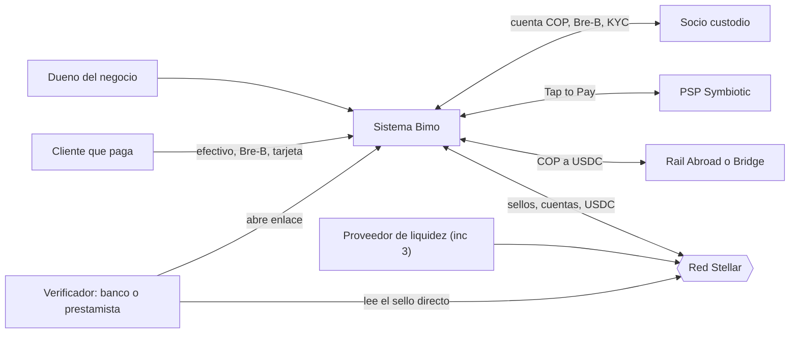
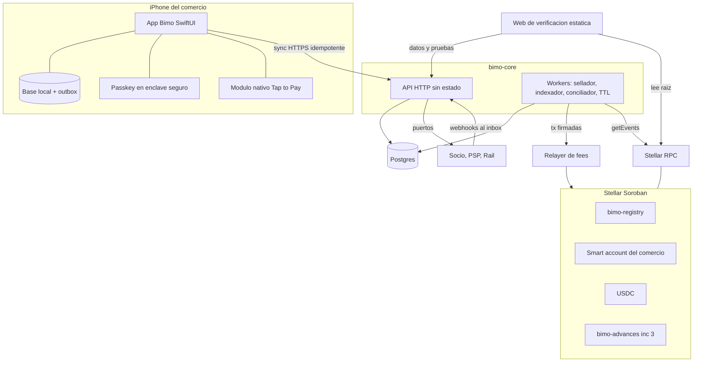
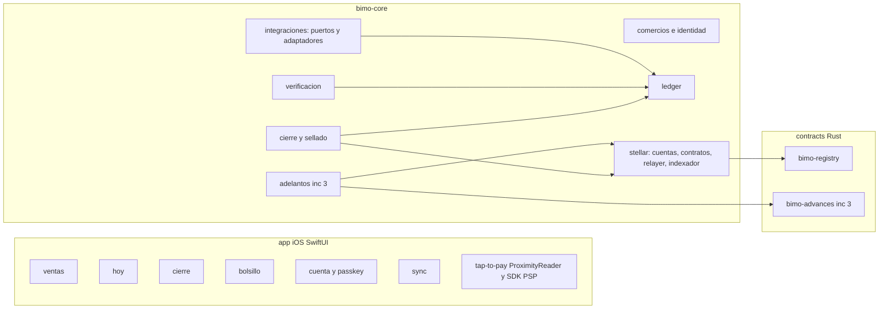
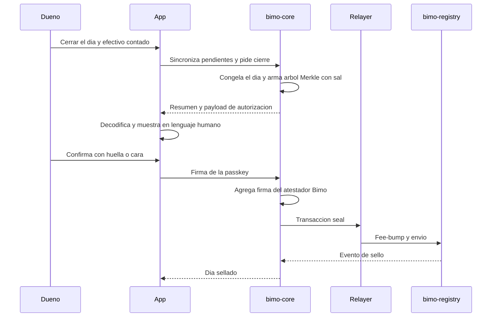
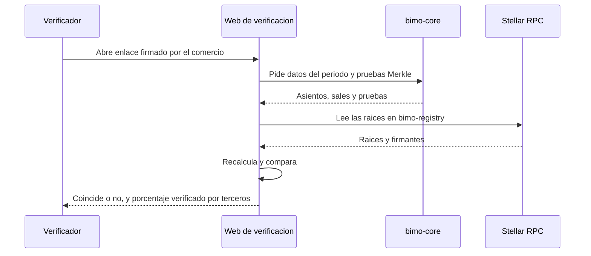

# Arquitectura de Bimo

Documento de trabajo del equipo (André, Santiago, Lizeth). Sigue el método del curso: entradas → drivers → ADD 3.0 por iteraciones → vistas → evaluación ligera tipo ATAM → trazabilidad. Cada decisión está registrada como ADR con su driver, alternativas y trade-off.

**Estado:** propuesta v0.2 (cliente decidido: iOS nativo en SwiftUI). Las decisiones marcadas como *Pendiente* las debe cerrar el equipo antes de construir lo que dependa de ellas.

---

## 0. Idea rectora

> **Los pesos viven en un socio regulado. El valor y la confianza viven en Stellar. Bimo es la experiencia y el ledger que une ambos mundos.**

Stellar no es un accesorio que se pega al final: es donde vive la cuenta del comercio, donde queda la prueba inalterable de sus ventas, donde guarda dólares y, más adelante, de donde sale la liquidez para adelantarle sus ventas con tarjeta. Todo eso ocurre sin que el dueño vea una semilla, una llave, XLM ni la palabra "blockchain".

| Rol de Stellar en Bimo | Qué resuelve para el comercio | Incremento |
|---|---|---|
| Cuenta inteligente (smart account Soroban con passkey) | Una cuenta propia que ni Bimo puede mover, protegida con su huella o cara | 1 |
| Registro de sellos diarios (contrato `bimo-registry`) | Historial de ventas que nadie puede alterar en silencio y que un tercero verifica solo | 1 |
| Fees patrocinados (relayer) | El comercio nunca compra ni ve XLM | 1 |
| Bolsillo en dólares (USDC) + rail COP↔USDC | Protegerse de la devaluación y pagar proveedores en el exterior | 1 (testnet, opcional) / 3 |
| Pool de adelantos (contrato `bimo-advances`) | Recibir hoy la plata de las ventas con tarjeta que el PSP consigna en 1-2 días | 3 |
| Historial crediticio verificable | Sellos + adelantos pagados a tiempo = reputación portable | 3 |

---

## 1. Entradas (paso 1 de ADD)

### 1.1 Propósito del diseño

1. Definir la **arquitectura objetivo** del producto completo (Tap to Pay, Bre-B, bolsillo en dólares, adelantos) y el **MVP del bootcamp como primer incremento** de esa misma arquitectura, sin rehacer nada al crecer.
2. Repartir el trabajo del equipo con límites de módulo claros.
3. Servir de base para justificar el uso de Stellar ante el Instaward / SCF.

### 1.2 Stakeholders y sus concerns

| Stakeholder | Concern principal |
|---|---|
| Dueño del negocio (usuario principal) | Registrar rápido, saber cuánto tiene y dónde, no perder plata, no aprender cripto |
| Empleado de confianza (incremento posterior) | Registrar ventas con su acceso, sin ver todo |
| Cliente que paga | Pagar como quiera (efectivo, Bre-B, tarjeta) |
| Verificador (banco, prestamista, proveedor) | Comprobar el historial sin confiar en el comercio ni en Bimo |
| Proveedor de liquidez del pool (incremento 3) | Riesgo, rendimiento y transparencia del pool |
| Socio custodio (Movii / Cobre) | Cumplimiento, KYC, integridad de la integración |
| PSP Tap to Pay (Symbiotic) | Uso correcto del SDK y del entitlement |
| Equipo de desarrollo | Construible en el bootcamp, módulos independientes, poco ops |
| Evaluadores bootcamp / SCF | Uso de Stellar necesario y no decorativo |

### 1.3 Actores y sistemas externos

| ID | Sistema externo | Qué aporta | Disponible en MVP |
|---|---|---|---|
| EXT-01 | Socio custodio (Movii o Cobre) | Cuenta en COP, llave Bre-B, KYC, webhooks de pagos recibidos y movimientos | Simulado |
| EXT-02 | PSP Tap to Pay (Symbiotic) | SDK nativo para cobrar con el celular, webhook de autorización y de liquidación | Simulado |
| EXT-03 | Rail COP↔USDC (Abroad; alterno Bridge) | On/off-ramp entre pesos (Bre-B) y USDC en Stellar | Simulado / testnet |
| EXT-04 | Red Stellar (Soroban RPC, contratos, USDC de Circle) | Cuentas, registro, tokens, liquidación | Testnet real |
| EXT-05 | Relayer de fees (OpenZeppelin Relayer / Stellar Channels) | Envío de transacciones con fee patrocinado (fee-bump) | Testnet real |
| EXT-06 | Proveedor de passkeys del sistema operativo (iCloud Keychain / Google Password Manager) | Llaves secp256r1 en el enclave seguro, sincronizadas entre dispositivos | Real |

### 1.4 Restricciones

| ID | Restricción | Origen |
|---|---|---|
| C-01 | Bimo **no custodia pesos** ni capta recursos del público; la custodia COP y el acceso a Bre-B los da un socio autorizado | Regulación financiera colombiana; decisión de producto |
| C-02 | Tap to Pay exige **app nativa**, SDK del PSP y entitlement de Apple. Plataforma: **solo iPhone compatible con Tap to Pay y versiones recientes de iOS** | Apple / PSP; decisión de producto |
| C-03 | Durante el bootcamp no hay convenios firmados: socio, PSP y rail van **simulados detrás de la misma interfaz** que tendrán en producción | Tiempo y alcance del bootcamp |
| C-04 | MVP en **testnet**; mainnet desde el incremento 2 | Riesgo y costo |
| C-05 | Equipo de 3 personas; stack: Swift/SwiftUI (app), TypeScript (`bimo-core`), Postgres/Supabase, Rust (Soroban) | Equipo |
| C-06 | Ley 1581 (Habeas Data): **ningún dato de ventas ni personal se publica en cadena** | Ley |
| C-07 | Usuario no cripto-nativo: sin seed phrases, sin XLM, sin jerga | Problem Brief |
| C-08 | Incremento 1 **sin Apple Developer Program pago**: sin Associated Domains (no hay passkeys nativas), sin TestFlight ni entitlement de Tap to Pay; la app corre en simulador o en el iPhone del equipo con cuenta gratuita | Presupuesto |

### 1.5 Casos de uso primarios

| ID | Caso de uso | Historias | Incremento |
|---|---|---|---|
| CU-01 | Abrir cuenta de comercio y crear su cuenta Stellar con passkey | — | 1 |
| CU-02 | Registrar una venta manual (efectivo, Bre-B, datáfono externo), incluido pago dividido y abono | H2, H7, H8 | 1 |
| CU-03 | Ver "Hoy": total por canal, disponible, pendiente de consignar y comisiones | H1, H3, H6 | 1 |
| CU-04 | Cerrar el día y sellarlo en Stellar | H4 | 1 |
| CU-05 | Verificar el historial (tercero, sin cuenta) | H5 | 1 |
| CU-06 | Cobrar con Tap to Pay | — | 2 |
| CU-07 | Recibir pagos Bre-B registrados automáticamente | — | 2 |
| CU-08 | Mover plata entre pesos y el bolsillo en dólares | — | 1 (testnet) / 3 |
| CU-09 | Pedir un adelanto de ventas con tarjeta y repagarlo automáticamente | — | 3 |

---

## 2. Drivers: escenarios de atributos de calidad

Prioridad = (importancia para el negocio, dificultad arquitectónica). Las cifras son metas propuestas; las marcadas con † hay que medirlas en testnet.

### QA-01 Integridad del historial — (H, H)
| Parte | Valor |
|---|---|
| Fuente | Cualquier persona con acceso a la base de datos (incluidos el dueño y el equipo de Bimo) |
| Estímulo | Modifica, borra o inserta una venta en un día ya sellado |
| Artefacto | Ledger y registro de sellos |
| Entorno | Operación normal |
| Respuesta | La verificación detecta la alteración e indica qué día no coincide |
| Medida | 100 % de alteraciones detectadas; prueba de inclusión de una venta individual verificable en < 3 s |

### QA-02 Seguridad de los fondos y de la firma — (H, H)
| Parte | Valor |
|---|---|
| Fuente | Atacante que compromete el backend de Bimo, o roba el celular desbloqueado |
| Estímulo | Intenta mover el USDC del comercio o sellar un día en su nombre |
| Artefacto | Smart account del comercio, contrato registry |
| Entorno | Operación normal |
| Respuesta | La operación es rechazada por la red sin la passkey del dueño (biometría) |
| Medida | 0 fondos movibles y 0 sellos posibles solo con llaves de Bimo |

### QA-03 Operación sin conexión — (H, H)
| Parte | Valor |
|---|---|
| Fuente | Entorno (sin internet en el local) o Stellar/RPC/relayer caídos |
| Estímulo | El dueño registra ventas y cierra el día |
| Artefacto | App y servicio de sellado |
| Entorno | Degradado |
| Respuesta | Las ventas se guardan localmente; al volver la conexión se sincronizan y el día se sella |
| Medida | 0 ventas perdidas con hasta 72 h sin conexión; sello publicado ≤ 15 min después de recuperar el servicio |

### QA-04 Usabilidad del registro — (H, M)
| Parte | Valor |
|---|---|
| Fuente | Dueño del negocio sin conocimientos cripto |
| Estímulo | Registra una venta en efectivo en hora pico |
| Artefacto | App |
| Entorno | Operación normal, una mano ocupada |
| Respuesta | Registro con monto y canal, sin términos técnicos |
| Medida | ≤ 3 toques y ≤ 5 s; 0 pantallas que mencionen wallet, token, XLM o blockchain |

### QA-05 Integrabilidad de socios y rails — (H, M)
| Parte | Valor |
|---|---|
| Fuente | Equipo de Bimo |
| Estímulo | Cambiar el simulador por el socio real, o Abroad por Bridge, o sumar un PSP |
| Artefacto | Módulo de integraciones |
| Entorno | Diseño / desarrollo |
| Respuesta | Se escribe un adaptador nuevo; dominio, ledger y contratos no cambian |
| Medida | ≤ 1 semana-persona por adaptador; 0 cambios fuera del adaptador |

### QA-06 Privacidad en cadena — (H, M)
| Parte | Valor |
|---|---|
| Fuente | Cualquiera que lea la red Stellar |
| Estímulo | Intenta reconstruir ventas o montos de un comercio a partir de los sellos |
| Artefacto | Contrato registry |
| Entorno | Operación normal |
| Respuesta | Solo encuentra raíces de hash con sal; los montos no son adivinables por fuerza bruta |
| Medida | 0 montos, nombres o documentos en cadena |

### QA-07 Costo de red por comercio — (M, M)
| Parte | Valor |
|---|---|
| Fuente | Operación diaria |
| Estímulo | 30 cierres al mes por comercio |
| Artefacto | Relayer y contratos |
| Entorno | Mainnet |
| Respuesta | Bimo patrocina las fees |
| Medida | Costo de red < US$0,10 por comercio al mes † |

### QA-08 Escalabilidad del cierre — (M, M)
| Parte | Valor |
|---|---|
| Fuente | 10.000 comercios |
| Estímulo | Cierran el día entre 8 y 10 p. m. |
| Artefacto | Servicio de sellado y relayer |
| Entorno | Pico diario |
| Respuesta | Los sellos se encolan y se envían en paralelo por canales del relayer |
| Medida | 100 % de días sellados < 1 h después del cierre † |

### QA-09 Verificación rápida — (M, L)
Un analista abre el enlace de verificación → ve el resultado (coincide / no coincide) en < 5 s p95, sin crear cuenta.

### QA-10 Cambio de red — (M, L)
Pasar de testnet a mainnet → solo configuración (RPC, IDs de contrato, passphrase, relayer); 0 cambios de código.

---

## 3. Diseño con ADD 3.0

### Tablero de drivers

| Driver | It. 1 | It. 2 | It. 3 | It. 4 | It. 5 | It. 6 | Estado |
|---|---|---|---|---|---|---|---|
| CU-01 a CU-05 | ● | ● | ● | | | | Atendido |
| CU-06, CU-07 | | | | ● | | | Parcial (simulado) |
| CU-08, CU-09 | | | ● | ● | | | Parcial (diseño; contrato de adelantos en inc. 3) |
| QA-01 Integridad | | ● | ● | | | | Atendido |
| QA-02 Seguridad | | | ● | | | ● | Atendido |
| QA-03 Offline | ● | ● | | | ● | | Atendido |
| QA-04 Usabilidad | ● | | ● | | | | Atendido |
| QA-05 Integrabilidad | ● | | | ● | | | Atendido |
| QA-06 Privacidad | | ● | ● | | | ● | Atendido |
| QA-07 Costo | | | ● | | | | Parcial (medir) |
| QA-08 Escalabilidad | | | ● | | ● | | Parcial (medir) |
| QA-09, QA-10 | | | ● | | | | Atendido |
| C-01 a C-07 | ● | | ● | ● | | ● | Atendido |

---

### Iteración 1 — Estructura general del sistema

**Drivers:** C-01, C-02, C-03, C-05, QA-03, QA-05.
**Elemento a refinar:** el sistema completo.

**Conceptos considerados**

| Alternativa | A favor | En contra |
|---|---|---|
| A. Monolito modular (puertos y adaptadores) + app nativa + contratos Soroban | Un solo despliegue, poco ops, límites de módulo claros, fácil de partir después | Escala como un bloque |
| B. Service-based (3-4 servicios de grano grueso) | Despliegue independiente de sellado e integraciones | Más ops y red para un equipo de 3 |
| C. Microservicios | Escalado y despliegue fino | Desproporcionado: datos distribuidos, contratos entre servicios, observabilidad |

**ADR-01 — Monolito modular hexagonal (`bimo-core`) + app móvil nativa offline-first + capa on-chain en Soroban.**
- *Por qué:* el equipo y el tiempo (C-05) no justifican lo distribuido; la arquitectura hexagonal deja cada sistema externo detrás de un puerto (QA-05) y permite simuladores en el MVP (C-03).
- *Trade-off:* se pierde escalado independiente. Se compensa separando desde ya dos procesos del mismo código: **API** (sin estado) y **workers** (sellado, indexación, conciliación), que se pueden escalar por separado (QA-08).

**Arquitecturas de referencia:** aplicación móvil de cliente enriquecido (con base local), aplicación de servicios (API + workers), aplicación web estática (verificación pública).

**ADR-02 — Bimo no custodia pesos.** La cuenta COP y la llave Bre-B están en el socio (EXT-01). En Stellar, el comercio tiene su propia cuenta no custodial (ADR-04). Bimo nunca tiene control sobre la plata del comercio en ningún lado.
- *Trade-off:* dependemos del socio para Bre-B y KYC (riesgo R-04), pero evitamos una licencia que el proyecto no puede obtener.

**ADR-03 — App nativa iOS en Swift/SwiftUI.**

| Alternativa | Problema |
|---|---|
| Flutter | Tap to Pay y passkeys llegan por plugins o puentes propios; un lenguaje más (Dart) sin código compartido con el backend |
| React Native (Expo) | Comparte TypeScript con `bimo-core`, pero igual exige envolver el SDK de Tap to Pay y depender de un plugin para passkeys |
| **SwiftUI nativo (elegida)** | — |

- *Por qué:* el producto es solo iPhone (C-02), así que lo multiplataforma no aporta. Tap to Pay (ProximityReader y SDK del PSP) y passkeys (`AuthenticationServices`) se usan sin intermediarios, justo en las partes más sensibles. Stellar desde Swift con `stellar-ios-mac-sdk` (Soneso), que soporta Soroban y decodificación de XDR (ADR-07). Base local con SwiftData o GRDB (ADR-08).
- *Trade-off:* una app Android futura se escribe aparte. Se compensa con el cliente delgado (ADR-07): la lógica vive en `bimo-core` y la app es sobre todo UI, captura y firma.
- *Riesgo asociado:* la serialización canónica de los asientos existe en Swift y en TypeScript; si difieren, los hashes no coinciden (R-09).

---

### Iteración 2 — Funcionalidad primaria: ledger, registro y cierre

**Drivers:** CU-02, CU-03, CU-04, QA-01, QA-03, QA-06.
**Elemento a refinar:** módulos de dominio de `bimo-core` y app.

**ADR-05 — Ledger de doble entrada y solo adición.**
Cada movimiento es un asiento inmutable con cuentas por comercio. Las correcciones son asientos de reverso visibles; nunca se edita ni se borra.

| Cuenta del comercio | Tipo | Ejemplo |
|---|---|---|
| Caja | Activo | Ventas en efectivo |
| Por cobrar PSP | Activo | Venta con tarjeta autorizada, aún no consignada |
| Cuenta en socio (COP) | Activo | Bre-B recibido, consignaciones del PSP |
| Bolsillo USD (Stellar) | Activo | USDC en la smart account |
| Adelantos por pagar | Pasivo | Adelanto recibido del pool (inc. 3) |
| Ventas | Ingreso | Toda venta, sin importar el canal |
| Comisiones | Gasto | Comisión del PSP o del canal |

Ejemplo: venta con tarjeta por $100.000 → *Debe* Por cobrar PSP / *Haber* Ventas. Cuando el PSP consigna $98.000 → *Debe* Cuenta en socio 98.000 + Comisiones 2.000 / *Haber* Por cobrar PSP 100.000. Con esto, H3 (pendiente de consignar) y H6 (comisiones) salen directamente de los saldos, sin lógica extra.

Cada asiento lleva su **origen**: `declarado` (lo registró el dueño), `verificado` (llegó firmado del socio o del PSP) u `on-chain` (tiene hash de transacción Stellar). El verificador ve qué proporción del historial está respaldada por terceros.

**ADR-08 — Offline-first con outbox.**
La app escribe cada venta en su base local (SQLite) con un ID generado en el celular (ULID) y la encola. La sincronización es idempotente: el servidor ignora IDs repetidos. La app nunca necesita red para vender (QA-03).
- *Trade-off:* consistencia eventual entre celular y servidor; conflictos posibles cuando haya empleados (se resuelven porque los asientos solo se agregan, no se editan).

**ADR-06 — Sello diario = raíz Merkle con sal, firmada por el comercio y por Bimo.**
Al cerrar el día, `bimo-core` congela los asientos del día, calcula para cada uno una hoja `hash(asiento_canónico ‖ sal_aleatoria)` y arma un árbol Merkle. Solo la raíz va a Stellar.

| Alternativa | Problema |
|---|---|
| Hash plano del resumen del día (lo del blueprint) | Para probar una sola venta hay que revelar el día completo |
| Una transacción por venta | Costo y latencia por venta; filtra volumen de ventas en cadena |
| **Raíz Merkle con sal (elegida)** | Se prueba una venta sin revelar las demás; la sal impide adivinar montos por fuerza bruta (QA-06) |

- *Trade-off:* hay que guardar las sales; si se pierden, ese día ya no se puede probar (riesgo R-06, mitigado con respaldo y exportación al comercio).

---

### Iteración 3 — La capa Stellar

**Drivers:** QA-01, QA-02, QA-04, QA-06, QA-07, QA-08, QA-10, CU-01, CU-04, CU-05, CU-08, C-06, C-07.
**Elemento a refinar:** el módulo `stellar` de `bimo-core` y los contratos.

**ADR-04 — La cuenta del comercio es una smart account de Soroban con passkey.**

| Alternativa | Problema |
|---|---|
| Cuenta clásica (G…) cuya llave guarda Bimo | Bimo sería custodio de cripto: punto único de ataque y choca con ADR-02 |
| Wallet externa (Freighter, Lobstr) | Rompe C-07: el tendero tendría que instalar y entender otra wallet |
| **Smart account con passkey (elegida)** | Llave en el enclave seguro del celular, firma con huella o cara, sin semilla; las passkeys se sincronizan con la cuenta de iCloud/Google |

Base: el contrato de cuenta auditado de OpenZeppelin `stellar-contracts` (passkeys secp256r1 habilitadas desde el Protocolo 21). Firmantes: la passkey del dueño. Política posterior: un firmante de recuperación con *timelock* (ver R-03). Las cuentas contrato reciben USDC sin trustlines.

*Variante del incremento 1 (por C-08):* el firmante es una **llave P-256 generada en el Secure Enclave del iPhone y protegida con Face ID** (CryptoKit + LocalAuthentication). Es la misma curva que una passkey y la misma experiencia para el dueño, pero no se sincroniza con iCloud ni usa el formato WebAuthn, así que la smart account necesita un verificador de firmas P-256 crudas (función `secp256r1_verify` de Soroban). En el simulador, que no tiene Secure Enclave, se usa una llave de software. En el incremento 2, con cuenta paga, se agrega la passkey real como firmante y la llave del enclave queda como respaldo.
- *Trade-off:* la recuperación de la cuenta es más compleja que un "olvidé mi contraseña".

**ADR-07 — Patrón de firma "cliente delgado".**
`bimo-core` arma la transacción y el payload de autorización; la app lo **decodifica y muestra en lenguaje humano** ("Sellar el lunes 6 de octubre: 34 ventas, $1.240.000") y solo entonces lo firma con la passkey; `bimo-core` ensambla y envía. Así el cliente no necesita reimplementar la lógica de Soroban, y aun así el dueño nunca firma a ciegas.

**ADR-09 — Fees patrocinadas con relayer.**
Todas las transacciones salen por el OpenZeppelin Relayer (servicio de canales de Stellar), que las envuelve en fee-bump y paga el XLM. El comercio nunca tiene XLM (C-07). Los canales paralelos permiten el pico de cierres (QA-08).
- *Trade-off:* el relayer pasa a ser un punto único de falla para enviar → táctica *degradación*: si falla, el día queda "cerrado, sello pendiente" y un worker reintenta; como plan B, una cuenta de Bimo con XLM envía el fee-bump directamente.

**Contrato `bimo-registry` (incremento 1)**

| Función | Autoriza | Efecto |
|---|---|---|
| `seal(comercio, día, raíz, n_asientos, flags_origen)` | Smart account del comercio **y** llave atestadora de Bimo | Guarda el sello; falla si ya existe un sello para ese día |
| `amend(comercio, día, raíz_nueva, motivo_hash)` | Ambos | Agrega una versión nueva; la anterior queda visible |
| `get(comercio, día)` | Público | Devuelve todas las versiones del sello |

Emite un evento por sello. La doble firma da **no repudio**: el comercio no puede negar lo que declaró y Bimo no puede sellar a su nombre (QA-02); la firma de Bimo certifica qué asientos llegaron de fuentes verificadas.
Cerrar el día = una confirmación con huella o cara. Es el único momento diario en que el dueño firma.

**ADR-10 — Verificación sin confiar en Bimo.**
El enlace de verificación entrega los datos del período y sus pruebas Merkle. La página (estática, de código abierto) **lee la raíz directamente de Stellar RPC**, no del API de Bimo, y recalcula en el navegador. Además se publica un script de verificación para que el banco pueda hacerlo con sus propias herramientas (QA-01, QA-09).

**ADR-11 — Indexador propio.**
Un worker lee los eventos de los contratos con `getEvents` de Stellar RPC y los guarda en Postgres como modelo de lectura (la RPC solo retiene una ventana corta de eventos). La app y el dashboard nunca consultan la red en caliente.

**Bolsillo en dólares (CU-08).** USDC (de Circle) en la smart account. El paso de COP a USDC y viceversa va por el puerto `RailCambio` (ADR-12). La app solo muestra "Pasar a dólares" y "Pasar a pesos"; cada salida de USDC exige passkey.

**Contrato `bimo-advances` (incremento 3, diseño preliminar).** Pool de USDC al que proveedores de liquidez aportan; el comercio pide un adelanto sobre ventas con tarjeta en estado *Por cobrar PSP* que Bimo atesta; recibe USDC (y lo pasa a pesos por el rail); cuando el PSP consigna, el repago se descuenta. Alternativas: contrato propio simple vs. tokenizar las cuentas por cobrar y usar un pool de Blend como colateral. *Diferido al inc. 3* (ver R-05: es crédito y tiene implicaciones regulatorias).

**Red configurable (QA-10).** RPC, passphrase, IDs de contrato y relayer viven en configuración por entorno.

---

### Iteración 4 — Integración con socio, PSP y rails

**Drivers:** QA-05, C-03, CU-06, CU-07, CU-08.
**Elemento a refinar:** módulo `integraciones`.

**ADR-12 — Puertos y adaptadores con simuladores.**

| Puerto | Adaptador MVP | Adaptador real |
|---|---|---|
| `Custodia` (cuenta COP, Bre-B, KYC, movimientos) | `CustodiaSimulada` | Movii o Cobre |
| `CobroTarjeta` (Tap to Pay, autorización, liquidación) | `TapToPaySimulado` | Symbiotic |
| `RailCambio` (COP↔USDC) | `RailSimulado` sobre testnet | Abroad (principal) o Bridge (alterno) |

Los eventos que llegan de afuera (webhooks) entran por un *inbox*: se valida la firma, se deduplican por ID externo y se traducen a asientos del ledger. Nada externo toca el dominio directamente (capa anticorrupción).
- *Trade-off:* hay más código de traducción, pero cambiar de socio o de rail no toca el núcleo.

**Tap to Pay (CU-06).** El SDK del PSP vive en un módulo nativo de la app. La app lanza el cobro; el resultado de la autorización se registra como asiento *verificado* en *Por cobrar PSP*; el webhook de liquidación lo mueve a *Cuenta en socio* con su comisión.

---

### Iteración 5 — Disponibilidad y resiliencia

**Drivers:** QA-03, QA-08.

| Táctica (Bass) | Dónde |
|---|---|
| Degradación | Sin red: se vende y se cierra en local. Sin Stellar: día "cerrado, sello pendiente" |
| Retry con backoff + idempotencia | Sincronización de la app, envío de sellos, webhooks |
| Transactions / outbox | Escribir el asiento y el mensaje a enviar en la misma transacción de BD |
| Circuit breaker | Llamadas al rail y al socio |
| Monitor + condition monitoring | Sellos pendientes > 15 min, saldo de XLM del relayer, TTL de los datos del contrato |
| State resynchronization | Conciliador diario: ledger vs. movimientos del socio vs. eventos on-chain |

**Archivo de estado de Soroban.** Los datos persistentes de un contrato se archivan si no se renueva su TTL (no se borran, se pueden restaurar). Un worker extiende el TTL de los sellos recientes y restaura los archivados cuando alguien los verifica.

---

### Iteración 6 — Seguridad y privacidad

**Drivers:** QA-02, QA-06, C-01, C-06.

| Táctica | Decisión |
|---|---|
| Autenticar actores | Sesión con OTP al celular; **step-up con passkey** para todo lo que mueve valor o sella |
| Autorizar / separar entidades | Row Level Security en Postgres por comercio; roles dueño / empleado |
| Limitar exposición | En cadena solo raíces, IDs seudónimos y flags; nada personal (C-06) |
| Separar llaves | Llave atestadora ≠ llave del relayer; ambas en un gestor de secretos, nunca en el repo |
| Verificar integridad de mensajes | Firmas de webhooks de socio y PSP |
| Auditar | Bitácora de solo adición de acciones administrativas |
| Revocar acceso | Rotar firmante atestador en `bimo-registry` (función de admin con multifirma del equipo) |

---

## 4. Vistas

### 4.1 Contexto

### 4.2 Componentes y conectores (runtime)

### 4.3 Módulos (asignación de trabajo)

Reglas: el `ledger` no depende de nadie; `stellar` e `integraciones` son los únicos módulos que hablan con el exterior; ningún módulo lee las tablas de otro (solo su interfaz).

Reparto sugerido: **André** → `stellar`, contratos, `cierre y sellado`, `verificacion`. **Santiago** → `ledger`, `comercios`, `integraciones`, `sync`. **Lizeth** → flujos y UI de la app, el lenguaje sin jerga (QA-04) y la página de verificación.

### 4.4 Despliegue

| Nodo | Qué corre | Notas |
|---|---|---|
| iPhone (iOS reciente) | App SwiftUI, base local (SwiftData/GRDB), passkey, SDK Tap to Pay | Requiere entitlement de Tap to Pay y Associated Domains para passkeys |
| Contenedor `api` (p. ej. Railway) | `bimo-core` en modo API | Sin estado, escalable horizontalmente |
| Contenedor `workers` | `bimo-core` en modo worker | Mismo código, otro proceso |
| Postgres gestionado (p. ej. Supabase) | Ledger, sales, inbox/outbox, modelo de lectura | Respaldos diarios (R-06) |
| Hosting estático | Web de verificación | Código abierto |
| Externos | OpenZeppelin Relayer, Stellar RPC, socio, PSP, rail | Testnet en inc. 1 |

### 4.5 Secuencia: cerrar y sellar el día (CU-04)

### 4.6 Secuencia: verificar (CU-05)

---

## 5. Incrementos

| Incremento | Alcance | Red |
|---|---|---|
| **1 — MVP bootcamp** | CU-01 a CU-05: cuenta con llave del Secure Enclave y Face ID, registro manual multicanal, "Hoy", cierre con sello co-firmado, verificación pública. Socio, PSP y rail simulados. *Opcional si sobra tiempo:* bolsillo USD con rail simulado | Testnet |
| **2 — Integraciones reales** | Apple Developer Program, passkeys reales, socio custodio (Bre-B automático, asientos verificados), Tap to Pay con Symbiotic, recuperación de cuenta, empleados | Mainnet |
| **3 — Servicios financieros** | Bolsillo USD con Abroad, adelantos con `bimo-advances`, pagos a proveedores en USDC, historial crediticio verificable | Mainnet |

---

## 6. Evaluación ligera (estilo ATAM)

*Versión ligera hecha por el propio equipo, no un ATAM completo.*

### Árbol de utilidad (hojas priorizadas)

- Integridad → QA-01 (H, H)
- Seguridad → QA-02 (H, H)
- Disponibilidad → QA-03 (H, H)
- Usabilidad → QA-04 (H, M)
- Integrabilidad → QA-05 (H, M)
- Privacidad → QA-06 (H, M)
- Costo → QA-07 (M, M); Escalabilidad → QA-08 (M, M)

### Puntos de sensibilidad y trade-offs

| Decisión | Mejora | Empeora |
|---|---|---|
| Co-firma del comercio al cerrar (ADR-06) | Integridad, no repudio | Usabilidad: un paso biométrico al día |
| Offline-first (ADR-08) | Disponibilidad | Consistencia: eventual |
| Sello diario y no por venta (ADR-06) | Costo, privacidad | Granularidad: una venta queda probada solo al cierre |
| Smart account no custodial (ADR-04) | Seguridad, confianza | Complejidad de recuperación |
| Relayer (ADR-09) | Usabilidad, costo para el comercio | Disponibilidad: dependencia externa |
| Monolito modular (ADR-01) | Simplicidad, velocidad del equipo | Escalado independiente |

### Riesgos

| ID | Riesgo (causa → consecuencia) | Mitigación |
|---|---|---|
| R-01 | Supuesto 2 del Brief falla: al dueño no le importa la inalterabilidad → el sello no genera valor percibido | Medir sellos y verificaciones de terceros; el valor de Stellar no depende solo del sello (bolsillo, adelantos) |
| R-02 | El entitlement de Tap to Pay o el convenio con Symbiotic tarda meses | Puerto `CobroTarjeta` con simulador; inc. 1 no depende de él |
| R-03 | El dueño pierde el celular y la passkey no está sincronizada → pierde acceso a su smart account | Firmante de recuperación con timelock y validación vía KYC del socio (diseñar en inc. 2) |
| R-04 | Dependencia del socio custodio (cambios de API, condiciones comerciales) | Puerto `Custodia`; evaluar Movii y Cobre en paralelo |
| R-05 | Adelantos = crédito; un pool abierto al público podría verse como captación | Diferido a inc. 3; validación legal antes de construir |
| R-06 | Se pierden las sales → días imposibles de probar | Respaldos, y exportación cifrada de los datos del día para el comercio |
| R-07 | Datos del contrato archivados por TTL | Worker de TTL y restauración bajo demanda |
| R-08 | Llave atestadora comprometida → sellos falsos co-firmados | No basta sola (requiere passkey del comercio); rotación vía multifirma |
| R-09 | La serialización canónica de asientos difiere entre Swift y TypeScript → hashes distintos y sellos que no verifican | Especificación única del formato canónico + vectores de prueba compartidos que ambos lados deben pasar en CI |

**Tema de riesgo:** casi todos los riesgos altos vienen de terceros (socio, PSP, Apple, regulación). La arquitectura los aísla detrás de puertos, pero no los elimina: son riesgos de negocio que hay que gestionar en paralelo.

---

## 7. Decisiones pendientes

| ID | Decisión | Recomendación | Quién |
|---|---|---|---|
| — | Socio custodio: Movii o Cobre | Decidir al iniciar el inc. 2 | André |
| ADR-13 | Contrato propio vs. Blend para adelantos, y de dónde sale la liquidez | Decidir antes del inc. 3, con asesoría legal | Equipo |

---

## 8. Trazabilidad

| Driver | Escenario | Decisiones | Elementos | Vistas | Evidencia |
|---|---|---|---|---|---|
| Historial confiable (H5) | QA-01 | ADR-05, 06, 10 | ledger, cierre y sellado, bimo-registry, web de verificación | 4.2, 4.5, 4.6 | Prueba: alterar un asiento y verificar → "no coincide" |
| No custodiar | QA-02, C-01 | ADR-02, 04, 07 | smart account, passkey | 4.2 | Prueba: transferir con solo llaves de Bimo → rechazada |
| Vender sin red | QA-03 | ADR-08, it. 5 | SQLite, outbox, sync | 4.2 | Prueba: 72 h en modo avión |
| Sin jerga | QA-04, C-07 | ADR-04, 07, 09 | app, relayer | 4.3 | Prueba con 5 comercios |
| Cambiar socio o rail | QA-05 | ADR-12 | integraciones | 4.3 | Cambiar simulador por adaptador real sin tocar el dominio |
| Privacidad | QA-06, C-06 | ADR-06 | bimo-registry | 4.2 | Revisión del estado del contrato |
| Costo y escala | QA-07, 08 | ADR-09, 11 | relayer, workers | 4.4 | Medición en testnet con carga simulada |
