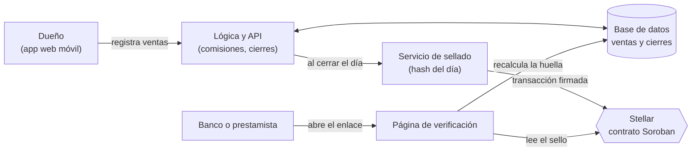

# Product Blueprint — BIMO

## Priorización de historias

Partimos de las historias individuales del equipo y elegimos las que pasan al backlog con cuatro criterios:

1. Atacan la fricción que priorizamos en el Problem Brief: la falta de un registro único y confiable, y las demoras y comisiones que el dueño no ve.
2. Completan el registro: si falta un canal de pago, el total del día no sirve.
3. Ponen a prueba nuestra hipótesis (supuesto 2 del Brief): que al dueño sí le importa tener un historial que no se pueda alterar.
4. Se pueden construir en el tiempo del bootcamp sin depender de convenios con bancos o PSP.

| ID | Historia | Origen | Prioridad |
| :---- | :---- | :---- | :---- |
| H1 | Ver en una sola pantalla lo vendido hoy, separado por canal | André #1, Lizeth #1 | Alta |
| H2 | Registrar una venta (efectivo incluido) en pocos toques | André #2, Lizeth #2 | Alta |
| H3 | Ver los pagos pendientes de consignación y su fecha estimada | André #3 | Alta |
| H4 | Cerrar el día comparando el registro con lo que realmente hay | André #4 | Alta |
| H5 | Que un banco o prestamista verifique que el historial no fue modificado | André #7, Lizeth #7 | Alta |
| H6 | Ver cuánto cobra cada canal en comisiones | André #6 | Media |
| H7 | Registrar un pago dividido en dos métodos como una sola venta | Lizeth #3 | Media |
| H8 | Registrar abonos o anticipos y ver cuánto falta por cobrar | Lizeth #4 | Media |

Quedan para una versión posterior: el empleado de confianza que registra ventas con su propio acceso (André #5) y las comisiones y propinas por empleada (Lizeth #5 y #6).

## Propuesta de valor

El dueño de un negocio pequeño o informal, el usuario que describimos en el Problem Brief, hoy termina el día abriendo varias aplicaciones, contando la caja y sumando a mano para saber cuánto vendió. Con BIMO obtiene un resultado simple: ve en una sola pantalla cuánto entró por efectivo, Bre-B, tarjeta y billeteras, cuánto de eso ya está en su cuenta y cuánto falta por consignar, y cierra el día en minutos en vez de pasar entre 15 y 30 minutos cuadrando (una estimación que todavía tenemos que medir).

Creemos que lo elegiría por tres razones. Primero, no le pide cambiar cómo cobra: sigue recibiendo efectivo, Bre-B o datáfono y solo registra la venta en pocos toques. Segundo, le muestra lo que hoy no ve: cuánto le cobra cada canal y cuándo llega realmente su plata. Tercero, con el tiempo va armando un historial de ventas que puede mostrarle a un banco o prestamista, sin llevar papeles y sin que nadie tenga que creerle solo por su palabra.

La diferencia frente a cómo lo resuelve hoy (cuadernos, hojas de cálculo o revisar cada app por separado) es que BIMO junta todos los canales en un solo registro y lo sella para que no se pueda cambiar en silencio. Además, el lenguaje de la app es el del negocio (ventas, caja, cierre del día): el usuario nunca necesita saber qué es una wallet o un token.

## Flujo de usuario

Roles: **dueño** (usuario principal), **cliente** (paga, no usa la app) y **verificador** (banco o prestamista que consulta el historial). En una versión posterior se sumará el empleado de confianza.

1. **Registro inicial (dueño).** Crea su cuenta de comercio desde el celular y marca los canales que usa: efectivo, Bre-B, datáfonos y billeteras. Para cada uno puede indicar su comisión y cuántos días demora en consignar.
2. **Venta (cliente y dueño).** El cliente paga como prefiera. El dueño abre BIMO y registra monto y canal en pocos toques. Si el pago se divide en dos métodos, reparte el monto; si es un abono de una cita, lo marca como anticipo.
3. **Cálculo automático (BIMO).** Guarda la venta y calcula la comisión estimada y la fecha en que debería llegar el dinero.
4. **Consulta del día (dueño).** En la pantalla "Hoy" ve el total por canal, lo que ya está disponible y lo que está pendiente de consignar.
5. **Cierre del día (dueño).** Toca "Cerrar el día", ingresa el efectivo contado y los saldos, y BIMO le muestra si hay diferencias para revisar.
6. **Sello (BIMO).** Al confirmar el cierre, BIMO genera la huella digital del día y la guarda en Stellar. Si después hay un error, se corrige con un ajuste visible, sin borrar lo anterior.
7. **Verificación (banco o prestamista).** Cuando el dueño necesita demostrar sus ingresos, genera un enlace de verificación. El analista lo abre sin crear cuenta, ve el resumen y comprueba que coincide con lo sellado en Stellar.

## Alcance del MVP

**Dentro del MVP (funcionalidad central):**

- Cuenta de comercio y configuración de canales (comisión y días de consignación por canal).
- Registro rápido de ventas por canal, incluido el efectivo, con pago dividido y abonos.
- Pantalla "Hoy" con total por canal, disponible y pendiente de consignar.
- Cierre del día con comparación entre lo registrado y lo contado.
- Sello diario en Stellar (testnet) y enlace público de verificación.

**Fuera del MVP (deseable):**

- Conexión automática con Bre-B, bancos y PSP (Bold, Redeban, Credibanco).
- Tap to Pay, wallet y liquidación en USDC.
- Bolsillo con rendimiento e historial crediticio completo.
- Empleados con permisos, comisiones y propinas por empleada.
- Escrows para pagos entre comercios, inventario y facturación.

## Backlog priorizado (Kanban)

**Tablero en GitHub Projects:** https://github.com/users/andreMD287/projects/2/views/1

## Arquitectura inicial

La interfaz es una aplicación web pensada para celular, que es lo que usa el dueño en el negocio. Detrás hay una capa de lógica y una base de datos tradicional donde viven las ventas, los canales y los cierres. Esta capa calcula comisiones y fechas estimadas de consignación, y arma el resumen de cada día. Proponemos Next.js y Supabase porque ya los conocemos, aunque el stack se puede ajustar.

La red entra en un punto concreto: cuando el dueño cierra el día. Un servicio de sellado calcula la huella digital (hash) del resumen del día y la envía en una transacción a un contrato de Soroban en Stellar, que solo permite agregar sellos nuevos. Registrar una venta no toca la red, así que el uso diario es rápido y no cuesta por venta.

La verificación hace el camino inverso: la página pública recalcula la huella con los datos del comercio y la compara con la que está guardada en Stellar. Los datos de ventas nunca se publican en la cadena, solo las huellas, para proteger la información del negocio. Durante el MVP usamos testnet.

## Uso de Stellar y justificación

En el Problem Brief justificamos el registro distribuido con dos criterios: el historial no debe poder alterarse y varias partes que no confían del todo entre sí necesitan compartir la misma verdad. Cada componente que usamos responde a alguno de esos dos.

- **Contrato de Soroban (registro de solo adición).** Guarda un sello por comercio y por día, y no permite editar ni borrar los anteriores. Cubre el criterio de historial inalterable: ni el dueño ni nosotros podemos reescribir un día ya sellado sin que se note.
- **Transacciones en la red Stellar.** Cada cierre se firma y se envía como una transacción. Las comisiones son muy bajas y la confirmación toma pocos segundos, lo que hace viable sellar todos los días a cada comercio.
- **Lectura pública con Soroban RPC.** Cualquier banco o prestamista puede consultar el sello sin pedirnos permiso y sin confiar en nosotros ni en el comercio. Cubre el criterio de varias partes que comparten un mismo registro.

Una base de datos tradicional sola obligaría al verificador a confiar en quien la administra. Con el sello en Stellar, ese tercero comprueba por su cuenta que los números no cambiaron. Somos conscientes del supuesto 2 del Brief: si a los dueños no les importa la inalterabilidad, bastaría una herramienta más simple. Por eso medimos cuántos sellos se generan y cuántas verificaciones hacen terceros. A futuro evaluaremos USDC en Stellar para liquidación y bolsillo, pero queda fuera del MVP.
