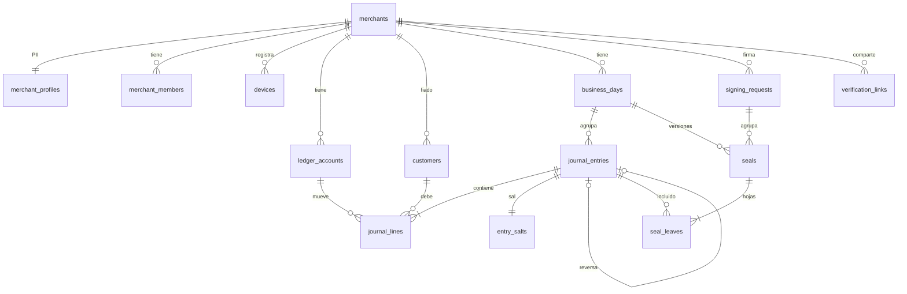

# Spec 01 — Modelo de datos

**Estado:** v1.3 · v1.3: salidas de plata (`salida`, `gastos`, `retiros_dueno`, tipo `patrimonio`) · v1.1: `merchant_changes`, `customers.updated_at`, regla de reloj (spec 04) · v1.2: `signing_requests`, `seals.signing_request_id`, `merchants.account_status`, DB-12 (spec 07) · **Depende de:** `docs/arquitectura/ARQUITECTURA.md` (ADR-05, 06, 08, 14, 16) · **Lo usan:** specs 02 a 09

Este documento es la fuente de verdad del esquema. Claude Code **no** crea tablas, columnas, enums ni estados que no estén aquí. Si algo falta, se actualiza este spec primero.

---

## 1. Reglas generales

| Tema | Regla |
|---|---|
| Motor | Postgres 15+ (Supabase) |
| IDs de datos creados en el celular | ULID en texto (26 caracteres, Crockford base32), generado en el dispositivo (ADR-08) |
| IDs de datos creados en el servidor | ULID generado por `bimo-core` |
| Dinero | `bigint` en **unidades mínimas**: COP en centavos (exponente 2), USDC en unidades de 10⁻⁷ (exponente 7). Nunca `float`, nunca `numeric` con decimales en el dominio |
| Moneda | Toda cantidad va acompañada de su `currency` (`COP` o `USDC`) |
| Tiempo | `timestamptz` siempre. La zona horaria de negocio es **`America/Bogota`** (UTC-5, sin horario de verano) |
| Día de negocio | `business_date = fecha calendario en America/Bogota de occurred_at` (ADR-14) |
| Inmutabilidad | Asientos y líneas: solo `INSERT`. `UPDATE` y `DELETE` bloqueados por trigger, salvo la función de borrado (ADR-16) |
| Datos personales | Solo en tablas marcadas **[PII]**; nada personal en tablas que se usan para hashes |
| Acceso | La app nunca habla con Postgres directamente; todo pasa por `bimo-core`. RLS activado en todas las tablas como segunda barrera |

---

## 2. Diagrama entidad-relación



---

## 3. Enums

```sql
create type member_role   as enum ('dueno', 'empleado');
create type key_kind      as enum ('secure_enclave_p256', 'software_p256', 'passkey_webauthn');
create type currency_code as enum ('COP', 'USDC');
create type account_type  as enum ('activo', 'pasivo', 'ingreso', 'gasto', 'patrimonio');
create type account_code  as enum (
  'caja',                 -- efectivo en el local
  'por_cobrar_clientes',  -- fiado
  'por_cobrar_psp',       -- tarjeta autorizada, no consignada
  'cuenta_socio',         -- COP en el socio custodio (Bre-B, consignaciones)
  'bolsillo_usd',         -- USDC en la smart account
  'adelantos_por_pagar',  -- inc. 3
  'ventas',
  'comisiones',
  'diferencias_caja',     -- faltantes (+) y sobrantes (-) al contar efectivo
  'gastos',               -- pagos a proveedores y otros gastos del negocio
  'retiros_dueno'         -- plata que el dueño saca del negocio
);
create type channel_code  as enum ('efectivo', 'breb', 'datafono_externo', 'tap_to_pay', 'fiado', 'transferencia_otro');
create type entry_kind    as enum (
  'venta', 'abono_cliente', 'liquidacion_psp', 'ajuste_caja', 'reverso',
  'conversion',           -- COP↔USDC (inc. 1 opcional / inc. 3)
  'salida'                -- pago de un gasto o retiro del dueño
  -- 'adelanto', 'repago_adelanto' se agregan en inc. 3 (cambio aditivo)
);
create type entry_origin  as enum ('declarado', 'verificado', 'on_chain');
create type line_direction as enum ('debe', 'haber');
create type day_status    as enum ('abierto', 'cerrado', 'firmado', 'sellado', 'requiere_enmienda');
create type seal_status   as enum ('preparado', 'firmado', 'enviado', 'confirmado', 'fallido');
create type outbox_status as enum ('pendiente', 'enviado', 'fallido');
create type signing_status as enum ('abierta', 'firmada', 'vencida', 'reemplazada');
create type account_status as enum ('pending', 'deploying', 'ready', 'failed');
```

Las transiciones de `day_status`, `seal_status`, `signing_status` y `account_status` se definen en el **spec 07**. Este spec solo fija los valores.

---

## 4. Tablas

### 4.1 Comercios e identidad

```sql
create table merchants (
  id                text primary key,                 -- ULID
  stellar_address   text unique,                      -- dirección C... de la smart account; null hasta desplegarla
  network           text not null check (network in ('testnet','mainnet')),
  account_status    account_status not null default 'pending',
  created_at        timestamptz not null default now(),
  forgotten_at      timestamptz                       -- ver ADR-16
);

-- [PII]
create table merchant_profiles (
  merchant_id       text primary key references merchants(id) on delete cascade,
  business_name     text not null check (length(business_name) <= 80),
  owner_name        text check (length(owner_name) <= 80),
  phone             text,
  city              text
);

create table merchant_members (
  merchant_id       text not null references merchants(id) on delete cascade,
  user_id           uuid not null references auth.users(id),
  role              member_role not null,
  created_at        timestamptz not null default now(),
  primary key (merchant_id, user_id)
);

create table devices (
  id                text primary key,                 -- ULID
  merchant_id       text not null references merchants(id) on delete cascade,
  user_id           uuid not null references auth.users(id),
  key_kind          key_kind not null,
  public_key        bytea not null,                   -- P-256 sin comprimir (65 bytes, SEC1)
  signer_registered_tx text,                          -- hash de la tx que lo agregó como firmante de la smart account
  created_at        timestamptz not null default now(),
  revoked_at        timestamptz,
  unique (merchant_id, public_key)
);
```

### 4.2 Ledger

```sql
create table ledger_accounts (
  id                text primary key,
  merchant_id       text not null references merchants(id) on delete cascade,
  code              account_code not null,
  type              account_type not null,
  currency          currency_code not null,
  unique (merchant_id, code, currency)
);
```

Al crear un comercio, `bimo-core` crea en la misma transacción estas cuentas:

| code | type | currency |
|---|---|---|
| caja | activo | COP |
| por_cobrar_clientes | activo | COP |
| por_cobrar_psp | activo | COP |
| cuenta_socio | activo | COP |
| bolsillo_usd | activo | USDC |
| ventas | ingreso | COP |
| comisiones | gasto | COP |
| diferencias_caja | gasto | COP |
| gastos | gasto | COP |
| retiros_dueno | patrimonio | COP |

`adelantos_por_pagar` se crea en el inc. 3.

```sql
-- [PII de terceros] clientes que compran fiado
create table customers (
  id                text primary key,                 -- ULID del celular
  merchant_id       text not null references merchants(id) on delete cascade,
  display_name      text not null check (length(display_name) <= 60),
  phone             text,
  created_at        timestamptz not null,
  updated_at        timestamptz not null            -- última edición; gana la más reciente (spec 04 §8)
);

create table business_days (
  id                text primary key,                 -- ULID del servidor
  merchant_id       text not null references merchants(id) on delete cascade,
  business_date     date not null,
  status            day_status not null default 'abierto',
  counted_cash_minor bigint,                          -- efectivo contado al cerrar (COP centavos)
  closed_at         timestamptz,
  closed_by         uuid references auth.users(id),
  current_seal_version int not null default 0,
  unique (merchant_id, business_date)
);

create table journal_entries (
  id                text primary key,                 -- ULID del celular (idempotencia del sync)
  merchant_id       text not null references merchants(id) on delete cascade,
  day_id            text not null references business_days(id),
  business_date     date not null,                    -- lo calcula el trigger, no el cliente
  occurred_at       timestamptz not null,             -- hora del celular
  recorded_at       timestamptz not null default now(),-- hora en que llegó al servidor
  kind              entry_kind not null,
  origin            entry_origin not null,
  reverses_entry_id text references journal_entries(id),
  external_source   text,                             -- 'custodia', 'psp', 'rail' (asientos verificados)
  external_ref      text,                             -- ID del evento externo
  note              text check (length(note) <= 140), -- texto libre del dueño; nunca entra al hash (spec 02)
  device_id         text references devices(id),
  created_by        uuid references auth.users(id),
  clock_suspect     boolean not null default false,   -- reloj del celular desfasado > 10 min al subirlo (spec 04 §7)
  unique (external_source, external_ref),
  check ((kind = 'reverso') = (reverses_entry_id is not null)),
  check (origin <> 'verificado' or external_ref is not null)
);

create table journal_lines (
  id                text primary key,                 -- ULID del celular
  entry_id          text not null references journal_entries(id),
  line_no           smallint not null,                -- orden dentro del asiento (entra al hash)
  account_id        text not null references ledger_accounts(id),
  direction         line_direction not null,
  amount_minor      bigint not null check (amount_minor > 0),
  currency          currency_code not null,
  channel           channel_code,                     -- obligatorio en líneas de cuentas de activo
  customer_id       text references customers(id),    -- obligatorio si la cuenta es por_cobrar_clientes
  unique (entry_id, line_no)
);

-- Separada para poder destruirla (ADR-16)
create table entry_salts (
  entry_id          text primary key references journal_entries(id) on delete cascade,
  salt              bytea not null check (length(salt) = 32),  -- CSPRNG en bimo-core al recibir el asiento
  created_at        timestamptz not null default now()
);
```

### 4.3 Sellos

```sql
create table signing_requests (            -- un Face ID para uno o más días (spec 03 §5.5, spec 07 §2)
  id                text primary key,
  merchant_id       text not null references merchants(id) on delete cascade,
  status            signing_status not null default 'abierta',
  preimage_xdr      bytea not null,                   -- HashIdPreimage que valida y firma la app
  expiration_ledger bigint not null,
  expires_at        timestamptz not null,
  created_at        timestamptz not null default now(),
  closed_at         timestamptz
);
create unique index on signing_requests (merchant_id) where status = 'abierta';

create table seals (
  id                text primary key,
  day_id            text not null references business_days(id),
  signing_request_id text references signing_requests(id),
  version           int not null check (version >= 1),  -- 1 = seal, >1 = amend
  merkle_root       bytea not null check (length(merkle_root) = 32),
  entry_count       int not null,
  origin_flags      int not null,                     -- bits definidos en spec 02
  amend_reason_hash bytea,                            -- solo version > 1
  merchant_signature bytea,
  attester_signature bytea,
  status            seal_status not null default 'preparado',
  tx_hash           text,                             -- varios sellos pueden compartir tx (firma de días pendientes en lote)
  ledger_seq        bigint,
  error             text,
  created_at        timestamptz not null default now(),
  confirmed_at      timestamptz,
  unique (day_id, version)
);

create table seal_leaves (
  seal_id           text not null references seals(id) on delete cascade,
  leaf_index        int not null,
  entry_id          text not null references journal_entries(id) on delete cascade,
  leaf_hash         bytea not null check (length(leaf_hash) = 32),
  primary key (seal_id, leaf_index),
  unique (seal_id, entry_id)
);
```

### 4.4 Verificación

```sql
create table verification_links (
  id                text primary key,
  merchant_id       text not null references merchants(id) on delete cascade,
  token_hash        bytea not null unique,            -- SHA-256 del token; el token solo existe en el enlace
  date_from         date not null,
  date_to           date not null check (date_to >= date_from),
  expires_at        timestamptz not null,
  revoked_at        timestamptz,
  created_at        timestamptz not null default now(),
  view_count        int not null default 0
);
```

### 4.5 Integración, mensajería e indexación

```sql
create table inbox_events (               -- webhooks entrantes (ADR-12)
  id                text primary key,
  source            text not null,                    -- 'custodia', 'psp', 'rail'
  external_id       text not null,
  payload           jsonb not null,
  signature_valid   boolean not null,
  received_at       timestamptz not null default now(),
  processed_at      timestamptz,
  error             text,
  unique (source, external_id)
);

create table outbox_messages (            -- trabajo pendiente hacia afuera
  id                text primary key,
  topic             text not null,                    -- 'seal.submit', 'ttl.extend', ...
  payload           jsonb not null,
  status            outbox_status not null default 'pendiente',
  attempts          int not null default 0,
  next_attempt_at   timestamptz not null default now(),
  last_error        text,
  created_at        timestamptz not null default now()
);

create table chain_events (               -- modelo de lectura del indexador (ADR-11)
  tx_hash           text not null,
  event_index       int not null,
  contract_id       text not null,
  ledger_seq        bigint not null,
  event_type        text not null,
  topics            jsonb not null,
  data              jsonb not null,
  ingested_at       timestamptz not null default now(),
  primary key (tx_hash, event_index)
);

create table merchant_changes (          -- feed de cambios por comercio para el pull (spec 04 §8); solo adición
  seq               bigserial primary key,
  merchant_id       text not null references merchants(id) on delete cascade,
  entity            text not null check (entity in ('entry','customer','day','seal')),
  entity_id         text not null,
  at                timestamptz not null default now()
);

create table indexer_cursor (
  contract_id       text primary key,
  last_ledger       bigint not null
);

create table audit_log (                  -- solo adición
  id                bigserial primary key,
  actor             text not null,
  action            text not null,
  target            text,
  detail            jsonb,
  at                timestamptz not null default now()
);
```

### 4.6 Índices

```sql
create index on journal_entries (merchant_id, business_date);
create index on journal_entries (day_id);
create index on journal_lines (entry_id);
create index on journal_lines (account_id);
create index on journal_lines (customer_id) where customer_id is not null;
create index on seals (status) where status in ('firmado','enviado','fallido');
create index on outbox_messages (status, next_attempt_at) where status = 'pendiente';
create index on chain_events (contract_id, ledger_seq);
create index on merchant_changes (merchant_id, seq);
```

---

## 5. Reglas que hace cumplir la base de datos

| ID | Regla | Mecanismo |
|---|---|---|
| DB-01 | Asientos y líneas no se editan ni se borran | Trigger `BEFORE UPDATE OR DELETE` que lanza error, salvo si la sesión tiene `bimo.forget = on` (solo lo activa `forget_merchant`) |
| DB-02 | `business_date` = fecha en America/Bogota de `occurred_at` | Trigger `BEFORE INSERT` sobre `journal_entries`; ignora lo que mande el cliente |
| DB-03 | `day_id` se resuelve solo | El mismo trigger busca o crea el `business_days` del comercio para esa fecha |
| DB-04 | Todo asiento cuadra: por cada moneda, suma de `debe` = suma de `haber` | Constraint trigger `DEFERRABLE INITIALLY DEFERRED` sobre `journal_lines` |
| DB-05 | Un asiento tiene al menos 2 líneas | Mismo constraint trigger |
| DB-06 | La línea usa una cuenta del mismo comercio y su misma moneda | Trigger `BEFORE INSERT` sobre `journal_lines` |
| DB-07 | `channel` es obligatorio en líneas de cuentas de activo; `customer_id` es obligatorio en `por_cobrar_clientes` | Mismo trigger |
| DB-08 | Un reverso apunta a un asiento del mismo comercio que no haya sido reversado antes | Trigger `BEFORE INSERT` |
| DB-09 | Si llega un asiento para un día en estado `sellado`, el día pasa a `requiere_enmienda` | Trigger `AFTER INSERT` (ver spec 07) |
| DB-10 | `verification_links`, `inbox_events`, `seals`: solo `bimo-core` escribe | RLS + rol de servicio |
| DB-11 | Todo `INSERT` en `journal_entries` y `customers`, todo `UPDATE` de `customers`, todo cambio de `status` en `business_days` y en `seals` agrega una fila a `merchant_changes` | Triggers `AFTER INSERT` / `AFTER UPDATE` |
| DB-12 | Un sello en estado `confirmado` no se edita ni se borra (salvo `forget_merchant`). Los sellos en otros estados sí pueden borrarse según spec 07 (L-6, S-3, S-4) | Trigger `BEFORE UPDATE OR DELETE` sobre `seals` |

### Saldos

```sql
create view account_balances as
select a.merchant_id, a.code, a.currency,
       coalesce(sum(case when l.direction = 'debe' then l.amount_minor else -l.amount_minor end), 0) as balance_minor
from ledger_accounts a
left join journal_lines l on l.account_id = a.id
group by a.merchant_id, a.code, a.currency;
```

Saldo con signo natural: activos, gastos y retiros positivos con `debe`; pasivos e ingresos se muestran negados en la app. El "Hoy" (CU-03) se calcula como dice el spec 04 §9.

---

## 6. Cómo se registra cada operación del incremento 1

Todos los montos en COP centavos; en los ejemplos se omiten los dos ceros.

| Operación | Líneas (debe / haber) | kind · origin |
|---|---|---|
| Venta en efectivo $20.000 | D caja 20.000 (efectivo) / H ventas 20.000 | venta · declarado |
| Venta dividida: $30.000 efectivo + $70.000 Bre-B | D caja 30.000 (efectivo) · D cuenta_socio 70.000 (breb) / H ventas 100.000 | venta · declarado |
| Venta con datáfono externo $100.000 | D por_cobrar_psp 100.000 (datafono_externo) / H ventas 100.000 | venta · declarado |
| Venta fiada $50.000 a Doña Rosa | D por_cobrar_clientes 50.000 (fiado, customer) / H ventas 50.000 | venta · declarado |
| Abono de Doña Rosa $20.000 en efectivo | D caja 20.000 (efectivo) / H por_cobrar_clientes 20.000 (customer) | abono_cliente · declarado |
| Consignación del datáfono $98.000 (comisión $2.000) | D cuenta_socio 98.000 · D comisiones 2.000 / H por_cobrar_psp 100.000 | liquidacion_psp · declarado (inc. 1) / verificado (inc. 2) |
| Al cerrar faltan $5.000 en caja | D diferencias_caja 5.000 / H caja 5.000 (efectivo) | ajuste_caja · declarado |
| Corregir una venta mal registrada | Asiento espejo de la original | reverso · declarado |
| Pago de $30.000 en efectivo a un proveedor | D gastos 30.000 / H caja 30.000 (efectivo) | salida · declarado |
| El dueño saca $50.000 por Bre-B | D retiros_dueno 50.000 / H cuenta_socio 50.000 (breb) | salida · declarado |

Un "pago dividido" es **un solo asiento** con varias líneas de débito. Una corrección es siempre **reverso + asiento nuevo**, nunca una edición.

---

## 7. Día calendario (ADR-14)

1. El día de un asiento lo define `occurred_at` del celular convertido a Bogotá. Una venta a las 12:15 a. m. pertenece al día siguiente.
2. El dueño puede cerrar el día D en cualquier momento, incluso antes de medianoche.
3. Si después del cierre llega un asiento de D (otra venta esa misma noche o una sincronización atrasada), el día pasa a `requiere_enmienda`. Al siguiente cierre, la app pide una sola firma para enmendar D y sellar el día actual.
4. Si el dueño no cierra un día, este queda `abierto`. Al abrir la app se le muestran los días sin cerrar, y los firma todos con **un solo Face ID** (sellado en lote, mismo `tx_hash`; ver spec 03).
5. `clock_suspect = true` cuando el reloj del celular difiere más de 10 min de la hora del servidor en la petición que subió el asiento (spec 04 §7). No se rechaza: el verificador lo ve.

---

## 8. Esquema local del iPhone

La app guarda solo lo necesario para vender sin red y mostrar "Hoy". La versión completa, con campos de sincronización, está en el spec 04 §2:

| Tabla local | Campos | Notas |
|---|---|---|
| `local_entries` | id, business_date, occurred_at, kind, origin, reverses_entry_id, note, sync_status | `business_date` con la misma regla de DB-02 |
| `local_lines` | id, entry_id, line_no, account_code, direction, amount_minor, currency, channel, customer_id | Usa `account_code`, no IDs del servidor |
| `local_customers` | id, display_name, phone, updated_at_ms, sync_status | |
| `local_days` | business_date, status, counted_cash_minor | Copia del estado que manda el servidor |
| `outbox` | entity, entity_id, attempts, last_error | Lo que falta subir |

El protocolo de sincronización se define en el **spec 04**.

---

## 9. Borrado de datos (ADR-16)

`forget_merchant(merchant_id)` (función `security definer`, solo rol de servicio):

1. Activa `bimo.forget = on` en la transacción.
2. Borra `entry_salts`, `seal_leaves`, `journal_lines`, `journal_entries`, `customers`, `merchant_profiles`, `verification_links`, `devices`, `merchant_changes` y `signing_requests` del comercio.
3. Marca `merchants.forgotten_at` y deja `seals` solo con raíz, versión y `tx_hash`.
4. Escribe en `audit_log`.

Sin sales ni asientos, las raíces que quedan en Stellar no permiten reconstruir nada.

---

## 10. Fuera de este spec

Tablas del inc. 2 y 3 (adelantos, conversiones reales con el rail, empleados con permisos finos). Se agregan después como **cambios aditivos**: tablas, columnas nulas o valores nuevos de enum. Ninguna puede modificar lo definido aquí sin una nueva versión de este spec.

---

## 11. Criterios de aceptación

- [ ] La migración inicial crea exactamente las tablas, enums, índices, triggers y la vista de este spec, y pasa en una base vacía de Supabase.
- [ ] Insertar un asiento descuadrado falla al hacer `commit` (DB-04).
- [ ] `UPDATE` o `DELETE` sobre `journal_entries` o `journal_lines` falla (DB-01).
- [ ] Un asiento con `occurred_at = 2026-10-07T04:30:00Z` queda con `business_date = 2026-10-06` (DB-02).
- [ ] Reenviar el mismo asiento (mismo ID) no crea duplicados.
- [ ] Insertar un asiento en un día `sellado` lo pasa a `requiere_enmienda` (DB-09).
- [ ] Los 10 ejemplos de la sección 6 se insertan y `account_balances` da los saldos esperados.
- [ ] `forget_merchant` deja al comercio sin asientos, sales ni PII, y `seals` solo con raíz, versión y `tx_hash`.
- [ ] Un usuario autenticado no puede leer datos de un comercio del que no es miembro (RLS).
- [ ] No se pueden crear dos `signing_requests` abiertas para el mismo comercio.
- [ ] Un `UPDATE` o `DELETE` sobre un sello `confirmado` falla (DB-12).
