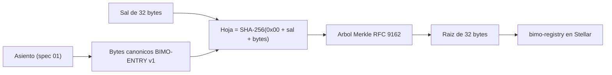

# Spec 02 — Formato canónico del asiento y árbol Merkle

**Estado:** v1.0 · **Depende de:** spec 01 · **Lo usan:** spec 03 (contrato), spec 05 (verificación), `bimo-core`, web de verificación
**Archivos:** `02-vectores.json` (vectores de prueba), `02-referencia.mjs` (implementación de referencia en JavaScript, sin dependencias), `02-check.mjs` (corre los vectores)

> Lo que se sella con este formato queda en Stellar para siempre. **Ningún byte de este spec cambia**. Si hace falta otro formato, se crea `BIMO-ENTRY` versión 2 con su propio spec, y la versión 1 se sigue verificando igual.

Este spec se validó con dos implementaciones independientes (Python y JavaScript) que producen exactamente los mismos bytes y hashes para todos los vectores.

---

## 1. Visión general



| Decisión | Elección | Por qué |
|---|---|---|
| Hash | SHA-256 | Disponible en Soroban, Node, navegadores (WebCrypto) y cualquier lenguaje de un banco |
| Codificación | Binaria, campos en orden fijo, enteros big-endian, textos con prefijo de longitud | Sin ambigüedades. JSON tiene problemas con enteros grandes, el orden de llaves y los espacios |
| Árbol | RFC 9162 (Certificate Transparency v2) | Estándar, sin duplicar nodos (evita el error de Bitcoin, CVE-2012-2459), con prefijos que separan hojas de nodos internos |
| Orden de las hojas | Por `id` del asiento, ascendente | Determinístico e independiente del servidor; los ULID ya ordenan por tiempo |

---

## 2. Tipos primitivos

| Tipo | Codificación |
|---|---|
| `u8` | 1 byte |
| `u16`, `u32` | 2 o 4 bytes, big-endian, sin signo |
| `i64` | 8 bytes, big-endian, complemento a dos |
| `u64` | 8 bytes, big-endian, sin signo |
| `str` | `u16` con la longitud en bytes + bytes UTF-8 en forma **NFC**. Máximo 65 535 bytes |
| `opt<str>` | `0x00` si no hay valor; `0x01` seguido del `str` si lo hay |

`bimo-core` normaliza a NFC todo texto al recibirlo, antes de guardarlo. Así lo que está en la base de datos es exactamente lo que se codifica.

---

## 3. Bytes canónicos `BIMO-ENTRY` versión 1

En este orden exacto, sin separadores:

| # | Campo | Tipo | Origen (spec 01) |
|---|---|---|---|
| 1 | Etiqueta | 10 bytes ASCII `BIMO-ENTRY` | constante |
| 2 | Versión | `u8` = `0x01` | constante |
| 3 | `merchant_id` | `str` | `journal_entries.merchant_id` |
| 4 | `id` | `str` | `journal_entries.id` |
| 5 | `business_date` | `u32` como número `AAAAMMDD` (ej. `20261006`) | `journal_entries.business_date` |
| 6 | `occurred_at` | `i64` en milisegundos desde 1970-01-01 UTC | `journal_entries.occurred_at` |
| 7 | `kind` | `u8` (tabla 5.1) | |
| 8 | `origin` | `u8` (tabla 5.2) | |
| 9 | `reverses_entry_id` | `opt<str>` | |
| 10 | `external_source` | `opt<str>` | |
| 11 | `external_ref` | `opt<str>` | |
| 12 | Número de líneas | `u16` | |
| 13 | Cada línea, ordenadas por `line_no` ascendente | ver 3.1 | `journal_lines` |

### 3.1 Línea

| # | Campo | Tipo |
|---|---|---|
| a | `line_no` | `u16` |
| b | `account_code` | `u8` (tabla 5.3) |
| c | `direction` | `u8` (tabla 5.4) |
| d | `amount_minor` | `u64` |
| e | `currency` | `u8` (tabla 5.5) |
| f | `channel` | `u8` (tabla 5.6; `0x00` = sin canal) |
| g | `customer_id` | `opt<str>` |

### 3.2 Lo que **no** entra al hash

`note`, `recorded_at`, `device_id`, `created_by`, `clock_suspect`, `day_id`, los IDs internos de cuenta y los nombres o teléfonos de clientes. Son datos internos, mutables o personales (C-06).

### 3.3 Precisión del tiempo

`occurred_at` se guarda con precisión de **milisegundos**: `bimo-core` trunca al recibir el asiento, antes de insertarlo. El celular manda milisegundos.

---

## 4. Hojas, nodos y raíz

```
hoja       = SHA-256( 0x00 ‖ sal[32] ‖ bytes_canónicos )
nodo       = SHA-256( 0x01 ‖ izquierda[32] ‖ derecha[32] )
raíz(∅)    = SHA-256( "" )                      -- día sin asientos
raíz([h])  = h
raíz(D[n]) = nodo( raíz(D[0:k]), raíz(D[k:n]) ) -- k = mayor potencia de 2 menor que n
```

- **Sal:** 32 bytes de un generador criptográfico (`crypto.randomBytes(32)`), creada una sola vez por asiento al recibirlo (`entry_salts`, spec 01). Nunca se reutiliza.
- **Hojas del día:** todos los asientos del comercio con ese `business_date`, incluidos los reversos, ordenados por `id` en orden ascendente de bytes ASCII.
- **Pruebas de inclusión:** *audit path* de RFC 9162 §2.1.3. La verificación es el algoritmo de RFC 9162 §2.1.3.2 (`verifyInclusion` en `02-referencia.mjs`).

---

## 5. Tablas de códigos

Son de **solo adición**: un código nunca se reutiliza ni cambia de significado.

### 5.1 `kind`
| venta | abono_cliente | liquidacion_psp | ajuste_caja | reverso | conversion | adelanto | repago_adelanto |
|---|---|---|---|---|---|---|---|
| 1 | 2 | 3 | 4 | 5 | 6 | 7 (reservado inc. 3) | 8 (reservado inc. 3) |

### 5.2 `origin`
| declarado | verificado | on_chain |
|---|---|---|
| 1 | 2 | 3 |

### 5.3 `account_code`
| caja | por_cobrar_clientes | por_cobrar_psp | cuenta_socio | bolsillo_usd | adelantos_por_pagar | ventas | comisiones | diferencias_caja |
|---|---|---|---|---|---|---|---|---|
| 1 | 2 | 3 | 4 | 5 | 6 | 7 | 8 | 9 |

### 5.4 `direction`
| debe | haber |
|---|---|
| 1 | 2 |

### 5.5 `currency`
| COP | USDC |
|---|---|
| 1 | 2 |

### 5.6 `channel`
| (sin canal) | efectivo | breb | datafono_externo | tap_to_pay | fiado | transferencia_otro |
|---|---|---|---|---|---|---|
| 0 | 1 | 2 | 3 | 4 | 5 | 6 |

---

## 6. Datos que acompañan la raíz en el sello

| Dato | Tipo en el contrato | Definición |
|---|---|---|
| `business_date` | `u32` | `AAAAMMDD` |
| `merkle_root` | `BytesN<32>` | Sección 4 |
| `entry_count` | `u32` | Número de hojas |
| `origin_flags` | `u32` | bit 0: hay asientos `declarado` · bit 1: hay `verificado` · bit 2: hay `on_chain` · bit 3: algún asiento con `clock_suspect`. Los demás bits van en 0 (reservados) |
| `amend_reason_hash` | `BytesN<32>` (solo en enmiendas) | Sección 7 |

---

## 7. Enmiendas

Cuando un día sellado recibe asientos nuevos (ADR-14), la versión N+1 vuelve a calcular la raíz con **todos** los asientos del día, y su motivo es:

```
amend_reason_hash = SHA-256( "BIMO-AMEND" ‖ 0x01 ‖ u32(cantidad) ‖ str(id_1) ‖ … ‖ str(id_k) )
```

donde `id_1 … id_k` son los asientos agregados desde la versión anterior, ordenados en orden ascendente.

Así un verificador puede reconstruir cualquier versión vieja. El conjunto de la versión N es el de la versión N+1 menos los IDs agregados, y debe dar la raíz N guardada en Stellar.

---

## 8. Cómo verifica un tercero

**Un día completo:**
1. Leer de Stellar las versiones del sello de `(comercio, fecha)` (spec 03), sin pasar por la API de Bimo.
2. Con los asientos y sales que entrega el enlace (spec 05), codificar cada asiento y calcular sus hojas.
3. Revisar que cada asiento tenga el `merchant_id` y el `business_date` esperados. Si uno no los tiene, el resultado es "no coincide".
4. Ordenar por `id`, calcular la raíz y compararla con la última versión. Comparar también `entry_count` y `origin_flags`.
5. Para las versiones anteriores, aplicar la sección 7.

**Una sola venta:** asiento + sal + `leaf_index` + `tree_size` + `audit_path`. Se verifica con `verifyInclusion` contra la raíz leída de Stellar, sin ver las demás ventas del día.

---

## 9. Vectores de prueba (resumen)

El archivo completo es `02-vectores.json`. Las sales de los vectores son determinísticas solo para poder reproducirlas: `SHA-256("bimo-test-salt-" + i)`. En producción son aleatorias.

| Vector | Qué prueba | Valor esperado |
|---|---|---|
| `venta_efectivo` | Asiento básico | hoja `8ac45b15f46df37c11c066642359e29310ad1270b217fbf9382a68a42a1e9015` |
| `venta_dividida` | Tres líneas, milisegundos no nulos | ver JSON |
| `venta_fiada` | `customer_id` presente | ver JSON |
| `reverso` | `reverses_entry_id` presente | ver JSON |
| `liquidacion_verificada` | `external_ref` con `ñ` (UTF-8 multibyte); 11:45 p. m. en Bogotá | `business_date = 20261006` |
| `venta_pasada_medianoche` | 12:15 a. m. en Bogotá | `business_date = 20261007` |
| Árbol de 0 hojas | Día vacío | `e3b0c442…b855` |
| Árbol de 5 hojas | Árbol desbalanceado | `550347fe72bcb7c23a0576eb793f410a6192c5d678b483eb1adfd880720b55ea` |
| Pruebas de inclusión | Tamaños 1, 3, 5 y 7 en varias posiciones | ver JSON |
| Día de ejemplo | Los 5 asientos del 6 de octubre | raíz `08594093d062d8af0c1130c30ec1944acb254293eaf291b956d27ac68716c08b` |
| Enmienda | Motivo con un ID agregado | `77ed84e572155b089033529ac927a1e8f4b69128ee44b7f26fae19a4585f1d0c` |

Bytes canónicos completos de `venta_efectivo`, como referencia de depuración:

```
42494d4f2d454e545259 01                      "BIMO-ENTRY", versión 1
001a 30314a41…5051                           merchant_id (26 bytes)
001a 30314a41…3041                           id (26 bytes)
0135288e                                     business_date 20261006
000001a112e8a940                             occurred_at 1791318600000 ms
01 01                                        kind venta, origin declarado
00 00 00                                     sin reverso, sin fuente, sin ref externa
0002                                         2 líneas
0001 01 01 00000000001e8480 01 01 00         línea 1: caja, debe, 2.000.000 centavos, COP, efectivo, sin cliente
0002 07 02 00000000001e8480 01 00 00         línea 2: ventas, haber, 2.000.000 centavos, COP, sin canal, sin cliente
```

---

## 10. Criterios de aceptación

- [ ] La implementación de `bimo-core` (TypeScript) produce exactamente los bytes, hojas, raíces y pruebas de `02-vectores.json`.
- [ ] La web de verificación produce los mismos resultados usando WebCrypto en el navegador.
- [ ] Cambiar 1 centavo, un canal, el orden de las líneas o la sal de cualquier asiento cambia la raíz del día.
- [ ] Una prueba de inclusión alterada o con `leaf_index` o `tree_size` incorrectos es rechazada.
- [ ] Un asiento de otro comercio o de otra fecha incluido en el día produce "no coincide".
- [ ] Un texto que no está en NFC se normaliza al recibirlo y nunca llega sin normalizar a la codificación.
- [ ] Las pruebas de CI de `bimo-core` y de la web de verificación corren contra `02-vectores.json` (`node docs/specs/02-check.mjs` imprime `fail=0`).
