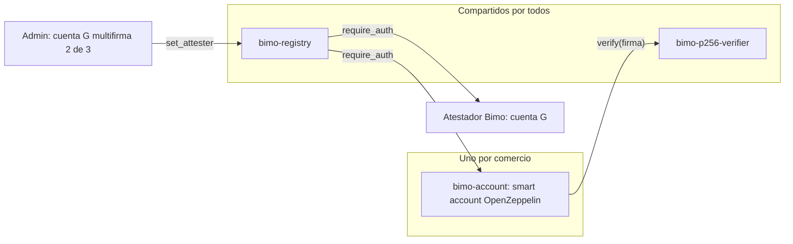
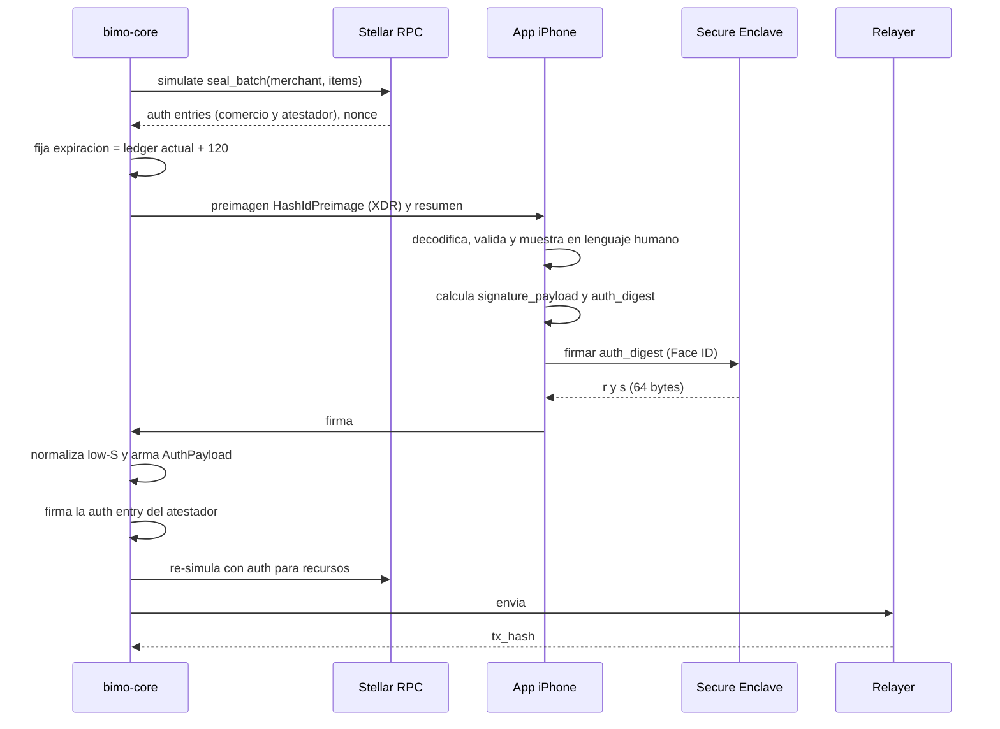

# Spec 03 — Contratos Soroban y flujo de firma

**Estado:** v1.0 · **Depende de:** ARQUITECTURA (ADR-04, 06, 07, 09, 14, 15), spec 01, spec 02 · **Lo usan:** `contracts/`, módulo `stellar` de `bimo-core`, módulo `cuenta y passkey` de la app, web de verificación

Define los tres contratos del incremento 1 y cómo se arma, firma y envía cada transacción. Claude Code no agrega funciones, parámetros, llaves de almacenamiento ni eventos que no estén aquí.

---

## 1. Piezas en cadena



| Contrato | Origen | Despliegue | ¿Actualizable? |
|---|---|---|---|
| `bimo-p256-verifier` | Propio, implementa el trait `Verifier` de OpenZeppelin | 1 por red | **No** (recomendación de OpenZeppelin para verificadores) |
| `bimo-account` | Smart account de OpenZeppelin `stellar-contracts` (paquete `accounts`), sin cambios de lógica | 1 por comercio | Solo con la autorización de la propia cuenta, es decir, la firma del dueño. Bimo no puede |
| `bimo-registry` | Propio | 1 por red | **No** (ADR-15) |

Herramientas: `soroban-sdk` y `stellar-contracts` en la última versión estable compatible entre sí, fijada en `Cargo.lock`; `stellar-cli` para compilar y desplegar.

---

## 2. `bimo-p256-verifier`

Verifica firmas P-256 crudas del Secure Enclave (variante del incremento 1, ADR-04).

```rust
type KeyData = BytesN<65>;   // clave pública SEC1 sin comprimir: 0x04 ‖ X ‖ Y
type SigData = BytesN<64>;   // r ‖ s big-endian, con s en la mitad baja (low-S)

fn verify(e: &Env, hash: Bytes, key_data: BytesN<65>, sig_data: BytesN<64>) -> bool {
    // hash = auth_digest de 32 bytes que calcula la smart account (sección 5.3)
    let digest = e.crypto().sha256(&hash);          // el Secure Enclave firma SHA-256(auth_digest)
    e.crypto().secp256r1_verify(&key_data, &digest, &sig_data); // falla (panic) si no es válida
    true
}

fn canonicalize_key(e: &Env, key_data: BytesN<65>) -> Bytes {
    // exige key_data[0] == 0x04; devuelve los 65 bytes tal cual
}
```

**Por qué el doble SHA-256:** `SecureEnclave.P256.Signing.PrivateKey.signature(for: Data)` de CryptoKit siempre aplica SHA-256 al dato antes de firmar. Pasarle el `auth_digest` como dato hace que la firma quede sobre `SHA-256(auth_digest)`, y el verificador reproduce exactamente eso. Así no hay que usar APIs de bajo nivel en Swift.

**Low-S:** el host de Soroban exige `s ≤ n/2` en `secp256r1_verify`. El Secure Enclave no normaliza, así que **`bimo-core` normaliza toda firma** antes de armar la autorización: si `s > n/2`, reemplaza `s` por `n − s`. La app no hace aritmética de curvas.

### Vectores del verificador

| Dato | Valor (hex) |
|---|---|
| Clave privada (solo prueba) | `989fd7c843f06b56d7ba2e78eb612f9f4459d3aff1173689c1a82a4a9fb60bfc` |
| `key_data` | `04b609d9b7b75af1981c44fe316b89e3a0416a2b4cc0c42ae93ac5da8ba91215a8588f5c41d34fe80bcd7ed19e470bfc9b125a32350279d6ee867dffef85dae70e` |
| `hash` (auth_digest) | `d57e80ca9916952669f6de2da4f7b23cebe6fa88764c36919c7bd0edcb013f8f` |
| `SHA-256(hash)` | `79991d75ee6b2c2c7b043dc1b85fa55b8a02bd14dc3b28195ae24ef94dbdd2e7` |
| Firma low-S válida | `478017dab1238e75b685f8e322c7164bb695289e04efa4d132350439db498a055b11e328e975ef7f20d887dc6043e4c6e8df25f2cab0378b89e36556f525a8ad` |
| Firma high-S (rechazada por Soroban) | `359f38f09c89bc24abaaafc28aa31446d3b517ed054043127c2ecf28af9c62fff87eba6464a1cce15861f8df4c2272b4d5e35056d92fa2fcb6628b7ac3f3c366` |
| La misma, normalizada (aceptada) | `359f38f09c89bc24abaaafc28aa31446d3b517ed054043127c2ecf28af9c62ff0781459a9b5e331fa79e0720b3dd8d4ae703aa56cde7fb883d573f48386f61eb` |

---

## 3. `bimo-account` (smart account del comercio)

Contrato de cuenta de OpenZeppelin compilado tal cual; Bimo solo fija la configuración inicial.

| Configuración | Valor en el incremento 1 |
|---|---|
| Regla de contexto | Una sola, tipo `Default`, ID `0` |
| Firmantes de la regla 0 | `Signer::External(bimo-p256-verifier, clave_pública_del_iPhone)` |
| Políticas | Ninguna |
| Dirección | Determinística: desplegada por la cuenta `deployer` de Bimo con `salt = SHA-256("bimo-account-v1" ‖ merchant_id)` |

- En el incremento 2 se agrega la passkey real con `add_signer` sobre la regla 0, firmado por el dueño. No hace falta redesplegar.
- La cuenta recibe USDC sin trustline (es una dirección de contrato).
- Bimo **no** queda como firmante en ninguna regla. Esto es lo que hace cumplir QA-02 y ADR-02.

---

## 4. `bimo-registry`

### 4.1 Tipos

```rust
#[contracttype]
pub struct SealItem {
    pub date: u32,                         // AAAAMMDD
    pub root: BytesN<32>,                  // spec 02 §4
    pub entry_count: u32,
    pub origin_flags: u32,                 // spec 02 §6; bits 4..31 deben ser 0
    pub amend: Option<AmendInfo>,          // None = primer sello del día
}

#[contracttype]
pub struct AmendInfo {
    pub prev_version: u32,                 // versión vigente que se enmienda (control de concurrencia)
    pub reason_hash: BytesN<32>,           // spec 02 §7
}

#[contracttype]
pub struct SealRecord {
    pub version: u32,                      // 1, 2, 3…
    pub root: BytesN<32>,
    pub entry_count: u32,
    pub origin_flags: u32,
    pub reason_hash: Option<BytesN<32>>,
    pub attester: Address,                 // atestador que co-firmó
    pub ledger: u32,                       // e.ledger().sequence()
    pub timestamp: u64,                    // e.ledger().timestamp()
}

#[contracttype]
pub enum DataKey {
    Admin,                                 // instancia
    Attester,                              // instancia
    Latest(Address, u32),                  // persistente: (comercio, fecha) → u32 versión vigente
    Seal(Address, u32, u32),               // persistente: (comercio, fecha, versión) → SealRecord
}
```

### 4.2 Funciones

| Función | Autoriza | Comportamiento |
|---|---|---|
| `__constructor(admin: Address, attester: Address)` | — | Guarda ambos. Se ejecuta una sola vez al desplegar |
| `seal(merchant, item: SealItem)` | `merchant` **y** atestador vigente | Equivale a `seal_batch(merchant, [item])` |
| `seal_batch(merchant, items: Vec<SealItem>)` | `merchant` **y** atestador vigente (una sola vez cada uno para todo el lote) | Para cada ítem: si `amend` es `None`, exige que no exista `Latest` y guarda la versión 1. Si es `Some`, exige `Latest == prev_version` y guarda `prev_version + 1`. Todo o nada |
| `get(merchant, date) → Vec<SealRecord>` | Público | Todas las versiones, de la 1 a la vigente |
| `latest(merchant, date) → Option<SealRecord>` | Público | Solo la vigente |
| `extend_ttl(merchant, date)` | Público, cualquiera puede pagarlo | Extiende el TTL de `Latest` y de todas las versiones de ese día |
| `attester() → Address`, `admin() → Address` | Público | Lectura |
| `set_attester(new: Address)` | `admin` | Cambia el atestador. Los sellos viejos conservan el suyo |
| `set_admin(new: Address)` | `admin` | Cambia el admin |

`amend` del documento de arquitectura es un `SealItem` con `amend = Some(…)`; no hay función aparte. No existe ninguna función que borre, modifique un `SealRecord` o actualice el código del contrato.

### 4.3 Validaciones y errores

```rust
#[contracterror]
pub enum Error {
    AlreadySealed = 1,      // seal nuevo sobre un día con Latest
    NotSealed = 2,          // amend sobre un día sin Latest
    VersionConflict = 3,    // prev_version ≠ Latest
    InvalidDate = 4,        // año fuera de 2024..=2099, mes fuera de 1..=12 o día fuera de 1..=31
    ReservedFlags = 5,      // bits 4..31 de origin_flags ≠ 0
    EmptyBatch = 6,
    BatchTooLarge = 7,      // más de 14 ítems
    DuplicateDate = 8,      // la misma fecha dos veces en un lote
}
```

`bimo-core` también valida antes de enviar que la fecha no sea futura en Bogotá. El contrato no lo hace, para mantenerse mínimo.

### 4.4 Eventos

| Tópicos | Datos | Cuándo |
|---|---|---|
| `("sealed", merchant, date)` | `(version, root, entry_count, origin_flags)` | Cada ítem guardado |
| `("attester", old, new)` | `()` | `set_attester` |
| `("admin", old, new)` | `()` | `set_admin` |

El indexador (ADR-11) solo depende de estos eventos.

### 4.5 Almacenamiento y TTL

- `Admin` y `Attester` en almacenamiento de instancia. `Latest` y `Seal` en almacenamiento persistente.
- Al escribir, el contrato extiende el TTL de las llaves nuevas al máximo que permita la red.
- El worker de TTL (iteración 5) llama `extend_ttl` sobre los días cuyos datos estén por expirar. También extiende la instancia y el código de `bimo-registry`, del verificador y de cada `bimo-account`.
- Un dato archivado **no se pierde**: se restaura antes de leerlo o verificarlo.

---

## 5. Flujo de firma de un sello (ADR-07)



### 5.1 Lo que arma `bimo-core`

1. Construye la invocación `seal_batch(merchant, items)` con los datos del cierre (spec 02 §6) y la simula.
2. De la simulación toma dos auth entries con credenciales de dirección: la de la smart account y la del atestador.
3. Fija `signature_expiration_ledger = ledger_actual + 120` (unos 10 minutos). Si el dueño firma tarde, se repite desde el paso 1.
4. Envía a la app la preimagen completa `HashIdPreimage::SorobanAuthorization { network_id, nonce, signature_expiration_ledger, invocation }` en XDR base64.

### 5.2 Lo que valida la app antes de pedir Face ID

La app decodifica la preimagen con `stellar-ios-mac-sdk` y **rechaza** si algo no cuadra:

| Chequeo | Contra qué |
|---|---|
| `network_id` | SHA-256 del passphrase configurado (testnet en el incremento 1) |
| Contrato invocado | ID de `bimo-registry` en la configuración de la app |
| Función | `seal` o `seal_batch` |
| `merchant` | Dirección de su propia smart account |
| Fechas y `entry_count` de cada ítem | Su base local: días cerrados pendientes de firma y número de asientos de cada uno |
| Sub-invocaciones | Ninguna |

Después muestra "Sellar lunes 6 de octubre: 34 ventas, $1.240.000" (totales de su base local) y pide Face ID.

### 5.3 Qué se firma exactamente

```
signature_payload = SHA-256( XDR(HashIdPreimage) )                       -- 32 bytes
auth_digest       = SHA-256( signature_payload ‖ XDR(Vec<u32>[0]) )      -- regla de contexto 0 (OpenZeppelin)
firma             = ECDSA-P256 del Secure Enclave sobre SHA-256(auth_digest)  -- signature(for: auth_digest)
```

La app calcula `signature_payload` y `auth_digest` por su cuenta a partir de la preimagen que ya validó. **Nunca firma un hash que le manden hecho.**

### 5.4 Lo que arma `bimo-core` con la firma

```
credentials.signature = AuthPayload {
  context_rule_ids: [0],
  signers: { External(bimo-p256-verifier, clave_pública) : firma_low_S (64 bytes) }
}
```

Firma la auth entry del atestador con su llave ed25519 (gestor de secretos), re-simula para obtener recursos y envía por el puerto `Enviador` (sección 7). Guarda `tx_hash` en `seals` (spec 01).

### 5.5 Días pendientes en lote (ADR-14)

Todos los días `cerrado` o `requiere_enmienda` del comercio van en **un solo** `seal_batch` (máximo 14). Es una sola preimagen, una sola validación en la app y un solo Face ID. Si hay más de 14, se firman en tandas de 14, empezando por los más antiguos.

---

## 6. Creación de la cuenta (CU-01)

| Paso | Quién | Detalle |
|---|---|---|
| 1 | App | Crea la llave en el Secure Enclave con control de acceso `.privateKeyUsage` + `.biometryCurrentSet`. En el simulador usa una llave de software en el Keychain, detrás de la misma interfaz `Firmante` |
| 2 | App → core | Envía la clave pública (65 bytes) y la firma de un reto de un solo uso que mandó `bimo-core` (prueba de posesión) |
| 3 | Core | Verifica la firma del reto, guarda el dispositivo (`devices`, spec 01) y despliega `bimo-account` con el constructor de la sección 3, por el relayer |
| 4 | App | Lee **directamente de Stellar RPC**, sin pasar por `bimo-core`, la regla 0 de su cuenta, y comprueba que el único firmante es su clave. Si no, muestra error y no continúa |
| 5 | Core | Guarda `merchants.stellar_address` |

Si el iPhone se pierde en el incremento 1, la cuenta queda sin firmante usable. Los datos del ledger siguen en Bimo y se crea una cuenta nueva. La recuperación real llega en el incremento 2 (R-03).

---

## 7. Envío de transacciones (ADR-09)

Puerto `Enviador` en `bimo-core`, con dos adaptadores intercambiables:

| Adaptador | Uso |
|---|---|
| `EnviadorRelayer` | Principal: OpenZeppelin Relayer / Stellar Channels; paga las fees |
| `EnviadorDirecto` | Plan B: una cuenta G de Bimo con XLM envía con fee-bump |

Si falla el envío, el sello queda `fallido` con el error y el outbox reintenta con backoff (spec 01). Mientras la firma no expire se reenvía la misma; si expiró, se vuelve a pedir al dueño.

---

## 8. Cuentas y llaves de Bimo

| Cuenta | Tipo | Uso | Dónde vive la llave |
|---|---|---|---|
| `admin` | G con multifirma 2 de 3 (André, Santiago, Lizeth) | `set_attester`, `set_admin` | Cada miembro tiene la suya; nunca en el servidor |
| `attester` | G | Co-firma sellos | Gestor de secretos del servidor |
| `deployer` | G | Despliega `bimo-account` | Gestor de secretos del servidor |
| `fallback-submitter` | G con XLM | Plan B de envío | Gestor de secretos del servidor |

Ninguna de estas cuentas puede mover fondos de un comercio ni sellar sin su firma.

---

## 9. Configuración por red

Archivo `contracts/deployments/<red>.json`, versionado en el repo. Lo leen `bimo-core`, la app y la web de verificación:

```json
{
  "network": "testnet",
  "network_passphrase": "Test SDF Network ; September 2015",
  "rpc_url": "https://soroban-testnet.stellar.org",
  "registry_ids": ["C..."],
  "p256_verifier_id": "C...",
  "account_wasm_hash": "…",
  "attester": "G...",
  "admin": "G...",
  "deployer": "G...",
  "usdc_sac": "C..."
}
```

`registry_ids` es una lista: si alguna vez hay un `bimo-registry` nuevo (ADR-15), se agrega al final y el verificador consulta todos.

---

## 10. Criterios de aceptación

**Verificador**
- [ ] Con los vectores de la sección 2: la firma low-S y la high-S normalizada pasan; la high-S sin normalizar falla; una clave sin el prefijo `0x04` falla.

**Registry** (pruebas en Rust con `soroban-sdk` testutils)
- [ ] `seal` sin la autorización del comercio o sin la del atestador falla.
- [ ] Un segundo `seal` del mismo día falla con `AlreadySealed`.
- [ ] Una enmienda con `prev_version` desactualizado falla con `VersionConflict`.
- [ ] `seal_batch` con 15 ítems, sin ítems o con una fecha repetida falla, y no guarda nada.
- [ ] Después de `set_attester`, los sellos nuevos exigen el atestador nuevo y los viejos conservan el anterior.
- [ ] El contrato compilado no expone ninguna función de actualización de código ni de borrado.

**Flujo completo** (testnet)
- [ ] Una llave P-256 de software crea una `bimo-account` y la app comprueba su firmante leyendo directo de RPC.
- [ ] Un sello del día de ejemplo del spec 02 (raíz `0859…c08b`) queda en `bimo-registry` con la doble autorización, y `get` lo devuelve.
- [ ] La misma transacción firmada solo con llaves de Bimo es rechazada por la red (QA-02).
- [ ] Una preimagen alterada (otro `merchant`, otra fecha u otro contrato) es rechazada por la app antes de pedir Face ID.
- [ ] Un lote de 3 días pendientes se sella con un solo Face ID.
