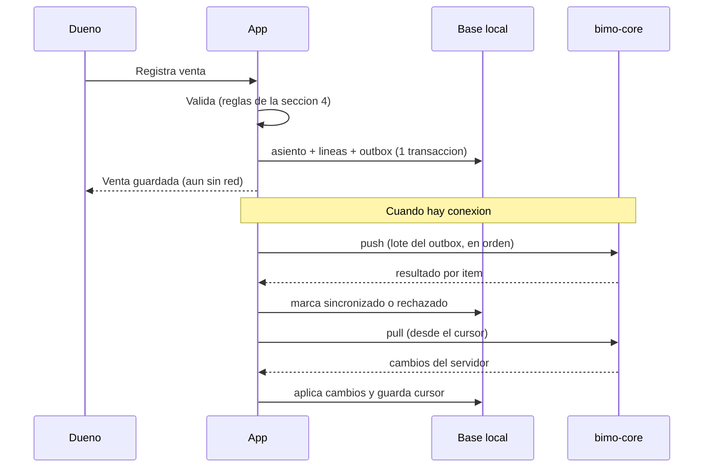
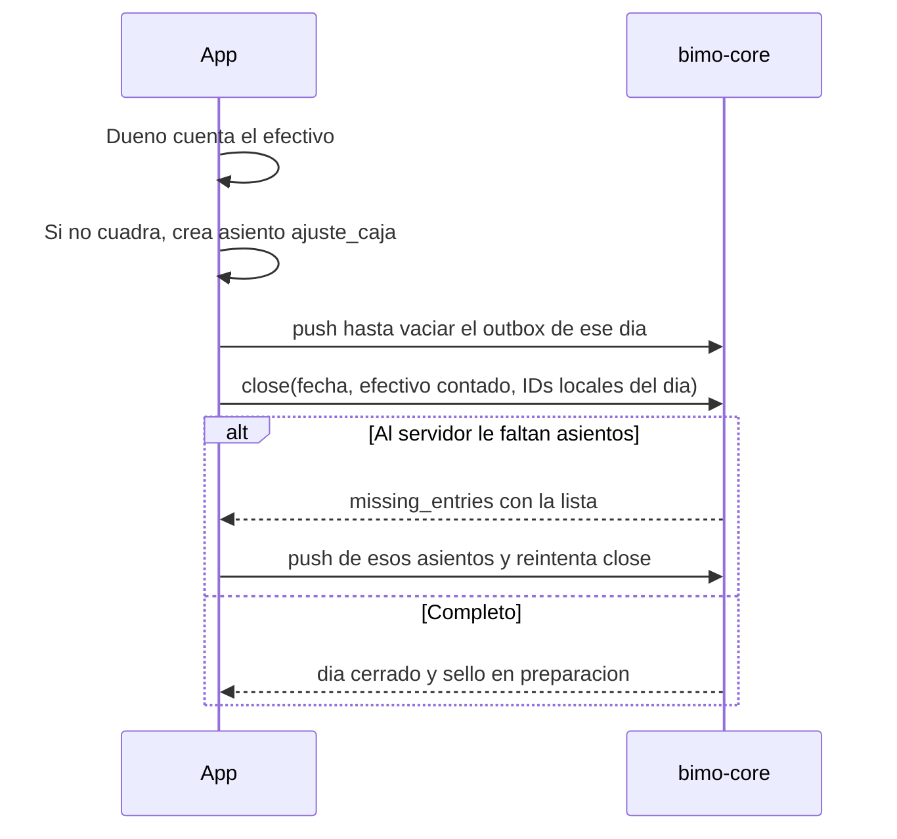

# Spec 04 — Sincronización offline

**Estado:** v1.2 (app en React Native: `expo-sqlite` y reglas en el paquete `shared`) · v1.1: `salida`, cálculos de "Hoy", pull antes de firmar · **Depende de:** ARQUITECTURA (ADR-08, 14), spec 01 (v1.3), spec 02 (v1.1) · **Lo usan:** módulo `sync` de la app, módulos `ledger` y `comercios` de `bimo-core`, spec 06 (API)

Define cómo la app vende sin internet y cómo se pone de acuerdo con el servidor sin perder ni duplicar nada (QA-03). Los endpoints exactos (rutas, autenticación, errores HTTP) están en el spec 06; aquí se define **qué** se intercambia y con qué reglas.

---

## 1. Principios

1. **El celular nunca necesita red para vender.** Toda venta se escribe primero en la base local y después se sube.
2. **Solo se agrega, nunca se edita.** Como los asientos son inmutables (ADR-05), no hay conflictos de edición: dos dispositivos solo pueden agregar asientos distintos.
3. **El ID lo pone el celular.** Reenviar el mismo asiento cualquier cantidad de veces da el mismo resultado (idempotencia).
4. **El servidor es la verdad del estado** (días, sellos, asientos verificados). **El celular es la verdad de lo que vendió** hasta que lo sube.
5. **La app valida con las mismas reglas que el servidor** (sección 4): las dos usan el mismo código del paquete `shared/`. Un rechazo del servidor es un error de programación, no un caso normal.

---

## 2. Base local del iPhone

**Decisión:** `expo-sqlite` (SQLite, incluido en Expo Go). Da transacciones explícitas, SQL que se parece al del servidor y migraciones controladas, que es lo que necesita un ledger.

Tablas (amplían spec 01 §8):

| Tabla | Campos | Notas |
|---|---|---|
| `local_entries` | id, business_date, occurred_at_ms, kind, origin, reverses_entry_id, note, **sync_status**, **reject_code**, created_on_device | `sync_status`: `pendiente` · `sincronizado` · `rechazado` |
| `local_lines` | id, entry_id, line_no, account_code, direction, amount_minor, currency, channel, customer_id | |
| `local_customers` | id, display_name, phone, updated_at_ms, sync_status | |
| `local_days` | business_date, status, counted_cash_minor, seal_status, pending_signature | Copia de lo que manda el servidor |
| `outbox` | seq (autoincremental), entity (`customer` · `entry` · `close`), entity_id, attempts, next_attempt_at, last_error | Cola FIFO |
| `sync_state` | pull_cursor, last_push_at, last_pull_at, clock_skew_ms | Una sola fila |

**Regla de escritura:** registrar una venta es **una sola transacción local** que inserta el asiento, sus líneas y la fila de `outbox`. O queda todo o no queda nada.

---

## 3. Flujo general



### 3.1 Cuándo sincroniza

| Disparador | Acción |
|---|---|
| Se guarda una venta | Push después de 2 s sin nuevas ventas (agrupa ráfagas) |
| La app pasa a primer plano | Push y pull |
| Vuelve la conexión (`@react-native-community/netinfo`) | Push y pull |
| Cada 60 s con la app abierta | Pull |
| En segundo plano (`expo-background-task`) | Push y pull, si iOS lo permite |
| Antes de cerrar el día | Push obligatorio (sección 6) |

### 3.2 Reintentos

Backoff exponencial por ítem: 1 s, 2 s, 4 s… hasta 5 min, sin límite de intentos para errores de red o 5xx. Un rechazo de validación (sección 5.2) **no** se reintenta.

---

## 4. Reglas de validación compartidas

Están implementadas **una sola vez**, en el paquete `shared/` (TypeScript), y las usan la app y `bimo-core`. Los códigos de rechazo son los de la sección 5.2.

| ID | Regla | Código |
|---|---|---|
| V-01 | `id` y los IDs de línea son ULID válidos (26 caracteres, Crockford base32, mayúsculas) | `invalid_id` |
| V-02 | Entre 2 y 20 líneas; `line_no` va de 1 a n, sin huecos | `invalid_lines` |
| V-03 | `amount_minor` entero entre 1 y 10¹² | `invalid_amount` |
| V-04 | Por cada moneda, suma de `debe` = suma de `haber` | `unbalanced` |
| V-05 | Las cuentas y la dirección permitidas para cada `kind` (tabla 4.1) | `invalid_accounts` |
| V-06 | El canal permitido para cada cuenta (tabla 4.2); sin canal en las cuentas que no son de activo | `invalid_channel` |
| V-07 | `customer_id` obligatorio en líneas de `por_cobrar_clientes` y prohibido en las demás; el cliente existe (o viene antes en el mismo lote) | `invalid_customer` |
| V-08 | Desde la app solo se acepta `origin = declarado` y sin `external_source` ni `external_ref`. `verificado` y `on_chain` solo los crea `bimo-core` | `forbidden_origin` |
| V-09 | Un `reverso` es el espejo exacto del asiento que reversa (mismas cuentas, montos, canales y clientes, con la dirección invertida), y ese asiento no fue reversado antes | `invalid_reversal` |
| V-10 | `note` de máximo 140 caracteres; textos en NFC | `invalid_text` |
| V-11 | `occurred_at` con precisión de milisegundos | `invalid_time` |

La hora **nunca** es motivo de rechazo: una venta registrada con un reloj equivocado se acepta y se marca (sección 7).

### 4.1 Cuentas por tipo de asiento (incremento 1)

| `kind` | Debe | Haber |
|---|---|---|
| `venta` | una o más de: caja, cuenta_socio, por_cobrar_psp, por_cobrar_clientes | ventas |
| `abono_cliente` | caja o cuenta_socio | por_cobrar_clientes |
| `liquidacion_psp` | cuenta_socio y, opcional, comisiones | por_cobrar_psp |
| `ajuste_caja` | diferencias_caja (faltante) o caja (sobrante) | caja (faltante) o diferencias_caja (sobrante) |
| `salida` | gastos (pago a proveedor u otro gasto del negocio) o retiros_dueno (plata que se lleva el dueño) | caja o cuenta_socio |
| `reverso` | según V-09 | según V-09 |

`conversion` (bolsillo en dólares) queda fuera hasta que se especifique; la app no la genera en el incremento 1.

### 4.2 Canal por cuenta

| Cuenta | Canales permitidos |
|---|---|
| caja | efectivo |
| cuenta_socio | breb, transferencia_otro, datafono_externo, tap_to_pay (los dos últimos solo en `liquidacion_psp`; en `salida` solo breb o transferencia_otro) |
| por_cobrar_psp | datafono_externo, tap_to_pay |
| por_cobrar_clientes | fiado |
| ventas, comisiones, diferencias_caja, gastos, retiros_dueno | sin canal |

---

## 5. Push (celular → servidor)

### 5.1 Petición

Lote de hasta 200 ítems del `outbox`, **en el orden de la cola**: los clientes van antes de los asientos que los usan, y los asientos antes de sus reversos.

```json
{
  "device_id": "01JA…",
  "device_time": "2026-10-06T21:00:00.123Z",
  "items": [
    { "type": "customer", "data": { "id": "01JA…", "display_name": "Doña Rosa", "phone": null, "updated_at": "…" } },
    { "type": "entry", "data": {
        "id": "01JA…", "occurred_at": "2026-10-06T20:30:00.000Z", "kind": "venta", "origin": "declarado",
        "reverses_entry_id": null, "note": null,
        "lines": [
          { "id": "01JA…", "line_no": 1, "account_code": "caja", "direction": "debe", "amount_minor": 2000000, "currency": "COP", "channel": "efectivo" },
          { "id": "01JA…", "line_no": 2, "account_code": "ventas", "direction": "haber", "amount_minor": 2000000, "currency": "COP" }
        ] } }
  ]
}
```

Los montos van como enteros JSON (el máximo de V-03 cabe sin perder precisión). Las fechas van en ISO-8601 UTC con milisegundos.

### 5.2 Respuesta, ítem por ítem

El servidor procesa los ítems **en orden, cada uno en su propia transacción**. Un ítem malo no bloquea a los demás.

| `result` | Significado | Qué hace la app |
|---|---|---|
| `accepted` | Guardado por primera vez | `sincronizado` |
| `duplicate` | Ya existía con el **mismo contenido** (mismos bytes canónicos del spec 02 sin sal; para clientes, mismos campos) | `sincronizado` |
| `id_conflict` | Ya existía ese ID con **otro contenido** | `rechazado`; reporta el error (es un bug) |
| `rejected` + `code` | Falló una regla de la sección 4 | `rechazado` con el código |
| `dependency_failed` | Depende de un ítem de este lote que no se aceptó | Queda `pendiente` y se reintenta después del ítem del que depende |

Para cada asiento aceptado o duplicado, el servidor devuelve también `business_date` y el estado del día. La app los usa para corregir su copia si su reloj estaba mal.

**Un asiento `rechazado` nunca se borra del celular.** La app lo muestra en "Ventas por revisar", con el monto, para que el dueño no pierda el registro. Puede reversarlo localmente o reportarlo.

### 5.3 Garantías

- Matar la app a mitad de un push no causa pérdidas ni duplicados: lo que no se marcó `sincronizado` se reenvía y el servidor responde `duplicate`.
- El servidor genera la sal (spec 02) solo la primera vez que acepta un asiento; un duplicado no la cambia.

---

## 6. Cierre del día con sincronización



- Si no hay conexión, la app marca el día `cerrado` localmente y encola un ítem `close` en el `outbox`. Se envía cuando vuelva la red, siempre **después** de los asientos de ese día que estén antes en la cola.
- `close` lleva `business_date`, `counted_cash_minor` y la lista de IDs de asientos de ese día que conoce este dispositivo. El servidor responde `missing_entries` si alguno de esos IDs no le ha llegado.
- Los asientos de **otros** dispositivos que lleguen después del cierre generan una enmienda (ADR-14, DB-09). No bloquean el cierre.
- La firma del sello (spec 03 §5) se pide cuando el servidor tiene la preimagen lista. La app se entera por el pull (sección 8).
- **Antes de pedir la solicitud de firma, la app hace un pull completo** (hasta `has_more = false`). Así su base local tiene los asientos creados por el servidor o por otros dispositivos, y la validación de `entry_count` del spec 03 §5.2 compara contra los mismos datos.

---

## 7. Reloj del celular

- Toda petición lleva `device_time`. El servidor calcula `skew = device_time − hora_del_servidor`.
- Si `|skew| > 10 min`, los asientos de **esa** petición quedan con `clock_suspect = true`, y la respuesta trae `clock_skew_ms` para que la app muestre "La hora de tu celular está mal; corrígela en Ajustes".
- Así se mide el reloj y no el tiempo que la venta pasó sin conexión. Una venta hecha hace 2 días sin red, con el reloj bien, **no** queda marcada.
- Esta regla reemplaza la de spec 01 §7.5 (actualizada en spec 01 v1.1).

---

## 8. Pull (servidor → celular)

El servidor mantiene, por comercio, un **feed de cambios** de solo adición (`merchant_changes`, spec 01 v1.1) con un número de secuencia creciente.

**Petición:** `cursor` (el último `seq` aplicado; 0 la primera vez) y `limit` (máximo 500).

**Respuesta:** cambios en orden de `seq`, más `next_cursor` y `has_more`.

| `entity` | Cuándo aparece | Qué hace la app |
|---|---|---|
| `entry` | Asiento creado por otro dispositivo o por `bimo-core` (verificados, simuladores) | Lo inserta si no lo tiene |
| `customer` | Cliente creado o editado en otro dispositivo | Inserta o reemplaza si `updated_at` es más reciente |
| `day` | Cambio de estado de un día | Actualiza `local_days` |
| `seal` | Cambio de estado de un sello, incluido "esperando tu firma" | Actualiza `local_days` y, si falta firma, muestra el aviso |

La app aplica cada página en **una sola transacción local** junto con el nuevo cursor. Si se interrumpe, repite la página y nada se duplica, porque todo se identifica por ID.

**Clientes:** son los únicos datos editables. Gana la última edición según `updated_at`.

---

## 9. "Hoy" en la app

"Hoy" se calcula **siempre** con la base local: los asientos sincronizados o no, más los que llegaron por pull. Así el dueño ve sus ventas al instante, aunque no haya red. Un indicador discreto muestra cuántas faltan por subir.

| Dato en pantalla | Cálculo (asientos de la fecha actual en Bogotá, salvo donde dice "saldo") | Historia |
|---|---|---|
| Vendido hoy | Σ `haber` − Σ `debe` de la cuenta `ventas` | H1 |
| Vendido por canal | En asientos `venta` y sus reversos: Σ de las líneas `debe` en cuentas de activo, agrupadas por `channel` (los reversos restan) | H1, H7 |
| Efectivo que debería haber en caja | **Saldo** de `caja` (todos los días) | H4 |
| En la cuenta (Bre-B y consignaciones) | **Saldo** de `cuenta_socio` | H1 |
| Pendiente de consignar | **Saldo** de `por_cobrar_psp` | H3 |
| Te deben (fiado) | **Saldo** de `por_cobrar_clientes`, con detalle por cliente | H8 |
| Comisiones de hoy | Σ `debe` − Σ `haber` de `comisiones` | H6 |
| Salidas de hoy | Σ `debe` de `gastos` y de `retiros_dueno` | — |

Al cerrar, el efectivo contado se compara con el **saldo** de `caja`. Si el dueño empieza a usar Bimo con plata ya en la caja, el primer cierre registra ese monto como `ajuste_caja` de sobrante; desde ahí la caja cuadra.

---

## 10. Varios dispositivos (incremento 2)

El protocolo ya los soporta: cada dispositivo tiene su `device_id` y su outbox; los asientos nunca chocan porque solo se agregan; el pull trae lo de los demás. Lo único que añade el incremento 2 son los permisos por rol (spec 06).

---

## 11. Criterios de aceptación

- [ ] En modo avión, la app registra 500 ventas durante 72 h. Al volver la red, el servidor tiene las 500, sin duplicados, en menos de 2 min.
- [ ] Matar la app durante un push y volver a abrirla no pierde ni duplica asientos.
- [ ] Enviar el mismo lote dos veces devuelve `duplicate` en todos los ítems la segunda vez.
- [ ] El mismo ID con otro monto devuelve `id_conflict`.
- [ ] Un asiento con `origin = verificado` enviado desde la app es rechazado con `forbidden_origin`.
- [ ] Un reverso de una venta que aún no se ha subido funciona si ambos van en orden en el mismo lote.
- [ ] Cerrar un día sin conexión y recuperar la red produce el cierre en el servidor, con los asientos de ese día completos.
- [ ] Con el reloj del celular adelantado 30 min, los asientos de ese push quedan con `clock_suspect` y la app muestra el aviso. Una venta antigua hecha sin red, con el reloj bien, no se marca.
- [ ] Las reglas V-01 a V-11 viven en `shared/` y pasan todos los casos de `shared/validation-cases.json`; la app y `bimo-core` importan ese mismo código.
- [ ] Una venta creada en el dispositivo A aparece en el dispositivo B después de un pull.
- [ ] Una `salida` de $30.000 en efectivo a `gastos` baja el saldo de `caja` en $30.000, y el cierre siguiente no muestra faltante por ese monto.
- [ ] Cada dato de la tabla de la sección 9 tiene una prueba con los ejemplos del spec 01 §6.
