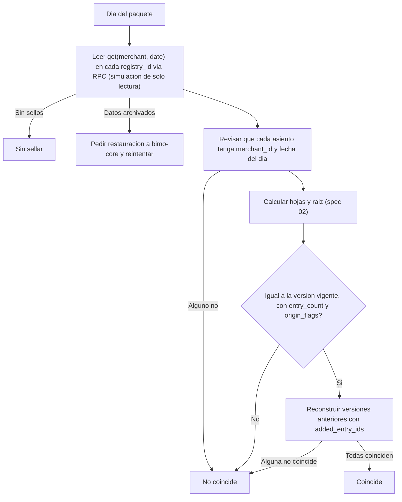

# Spec 05 — Enlace de verificación

**Estado:** v1.0 · **Depende de:** ARQUITECTURA (ADR-10, 16), spec 01, spec 02, spec 03 · **Lo usan:** módulo `verificacion` de `bimo-core`, web de verificación, app (pantalla "Compartir mi historial")

Define cómo el dueño comparte su historial y cómo un tercero (banco, prestamista, proveedor) lo comprueba **sin confiar en Bimo ni en el comercio** (QA-01, QA-09, CU-05).

---

## 1. Qué ve y qué no ve el verificador

| Ve | No ve |
|---|---|
| Nombre del negocio y dirección Stellar de su cuenta | Teléfono, nombre del dueño, ciudad |
| Cada asiento del período: fecha y hora, tipo, origen, cuentas, montos, canales | Notas libres del dueño |
| El ID seudónimo del cliente en ventas fiadas (necesario para el hash) | Nombre o teléfono de los clientes |
| Las sales de esos asientos (necesarias para recalcular las hojas) | Asientos fuera del período compartido |
| Totales por día y por canal **calculados en su navegador** a partir de los asientos verificados | Ningún total "declarado" por el servidor |

Regla de oro: **todo número que ve el verificador lo calculó su propio navegador** a partir de datos que coinciden con lo sellado en Stellar. La página nunca muestra un total que mande el servidor.

---

## 2. Creación del enlace (en la app)

1. El dueño elige el período (máximo 366 días, hasta ayer o hasta hoy si hoy ya está sellado) y la vigencia: 7, 30 (por defecto) o 90 días.
2. La app llama a `POST /v1/verification-links` (spec 06).
3. `bimo-core` genera un token de 32 bytes aleatorios, guarda solo su `SHA-256` en `verification_links.token_hash` (spec 01) y devuelve el enlace **una sola vez**:

```
https://verificar.<dominio>/#t=<token_base64url>
```

El token va en el fragmento (`#`), que el navegador nunca envía al servidor de hosting ni aparece en logs ni en el `Referer`. La página lo lee con JavaScript y lo manda solo a la API de Bimo, en el encabezado `Authorization`.

4. La app muestra el enlace con la hoja de compartir de iOS y lo lista en "Enlaces compartidos", con opción de **revocar** y con el número de veces que se abrió.

---

## 3. Paquete de verificación (respuesta de la API)

`GET /v1/public/verification?from=AAAA-MM-DD&to=AAAA-MM-DD` con `Authorization: Bearer <token>`. El rango pedido debe estar dentro del período del enlace; la API devuelve como máximo 31 días por petición y la página pide por tramos.

```json
{
  "format": "bimo-verification-v1",
  "merchant": {
    "merchant_id": "01JA…",
    "business_name": "Tienda Doña Marta",
    "stellar_address": "C…"
  },
  "network": {
    "network_passphrase": "Test SDF Network ; September 2015",
    "rpc_url": "https://…",
    "registry_ids": ["C…"]
  },
  "link": { "date_from": "2026-09-01", "date_to": "2026-10-06", "expires_at": "…" },
  "days": [
    {
      "date": 20261006,
      "status": "sellado",
      "entries": [
        { "entry": { "id": "01JA…", "merchant_id": "01JA…", "occurred_at": "…", "kind": "venta", "origin": "declarado",
                     "reverses_entry_id": null, "external_source": null, "external_ref": null,
                     "lines": [ … ] },
          "salt": "hex", "clock_suspect": false }
      ],
      "seals": [
        { "version": 1, "tx_hash": "…", "added_entry_ids": [] },
        { "version": 2, "tx_hash": "…", "added_entry_ids": ["01JA…"] }
      ]
    }
  ]
}
```

- `entry` tiene exactamente los campos del spec 02 §3, con los nombres de la tabla `journal_entries` y `journal_lines`, en el formato del vector `02-vectores.json`.
- `seals[].added_entry_ids` son los IDs agregados en cada enmienda; con ellos el verificador reconstruye las versiones anteriores (spec 02 §7).
- Los días del período sin asientos y sin sello aparecen con `entries: []` y `status` real.
- La API **nunca** manda raíces ni resultados de verificación: eso lo obtiene la página de Stellar.

Cada petición válida incrementa `view_count`. Si el enlace está vencido o revocado, responde `410 link_inactive`.

---

## 4. Algoritmo de la página

Usa la implementación de `02-referencia.mjs` adaptada a WebCrypto. Para cada día:



1. **Leer de Stellar.** Para cada `registry_id`, simula `get(merchant.stellar_address, date)` contra `network.rpc_url`. Usa **la red y los contratos del paquete solo si coinciden con los que la página trae compilados** para esa red (ver sección 6). Si no coinciden, muestra "Este enlace apunta a contratos desconocidos" y no verifica nada.
2. **Datos archivados.** Si la simulación indica que hay que restaurar, la página llama a `POST /v1/public/verification/restore` (spec 06), muestra "Recuperando registros antiguos…" y reintenta cada 10 s, hasta 2 minutos.
3. **Recalcular** con el algoritmo del spec 02 §8.
4. **Totales.** Solo con los asientos de días que coinciden, la página suma ventas por día y por canal, abonos, consignaciones y comisiones.

### 4.1 Resultado por día

| Estado | Ícono | Cuándo |
|---|---|---|
| Coincide | ✅ | La raíz y todas las versiones coinciden |
| Coincide con enmiendas | ✅ + "enmendado N veces" | Igual, con versión > 1; muestra qué asientos llegaron tarde |
| Sin sellar | ⚪ | No hay sello en Stellar (día abierto, cerrado sin firmar o en curso) |
| No coincide | ❌ | Cualquier diferencia. No se suman sus asientos a los totales |

### 4.2 Resumen del período

- Días que coinciden / sin sellar / no coinciden.
- Ventas totales y por canal, **solo de los días que coinciden**.
- Porcentaje de asientos `verificado` u `on_chain` frente a `declarado` (ADR-05).
- Cantidad de asientos con `clock_suspect`.
- Para cada día: enlace al `tx_hash` en un explorador público de Stellar.

Textos sin jerga para el analista: "Registros sellados en una red pública que ni Bimo ni el comercio pueden modificar." La palabra "blockchain" solo aparece en la sección "¿Cómo funciona?".

---

## 5. Verificación sin la página de Bimo

- Botón **"Descargar paquete"**: guarda el JSON de la sección 3 (todos los tramos unidos).
- Script público `verifier/cli/verify.mjs`: `node verify.mjs paquete.json` hace el mismo algoritmo contra cualquier RPC de Stellar que el banco elija (`--rpc <url>`) e imprime el resultado por día y los totales.
- Así un banco puede verificar con sus propias herramientas y su propio nodo, sin depender de que la web de Bimo exista (ADR-10).

---

## 6. Seguridad de la página

| Riesgo | Control |
|---|---|
| Una página falsa que diga "coincide" | La página es estática y de código abierto, y se publica con su hash en el repo. El script de la sección 5 permite verificar sin ella |
| Un paquete que apunte a contratos falsos | La página trae compilada la lista de `registry_ids` y el passphrase de cada red (de `contracts/deployments/*.json`) y rechaza cualquier otro |
| Token filtrado | Vence, se puede revocar y solo da acceso de lectura al período; nunca a la cuenta |
| Indexación por buscadores | `noindex`, sin el token en la URL del servidor |
| Abuso de la API | Límite de 60 peticiones por minuto por token |

---

## 7. Comprobante de una venta (opcional, incremento 2)

`GET /v1/public/entry-proof?entry_id=…` con el mismo token devuelve un asiento, su sal, `leaf_index`, `tree_size` y `audit_path` (spec 02 §8). Permite probar una venta sin revelar el resto del día. La API se reserva desde ya; la pantalla se hace en el incremento 2.

---

## 8. Criterios de aceptación

- [ ] El paquete de un período con el día de ejemplo del spec 02 da "Coincide" en la página y en el script.
- [ ] Cambiar 1 centavo de un asiento en la base de datos hace que ese día dé "No coincide" y que sus montos no entren a los totales.
- [ ] Un día enmendado muestra las dos versiones y cuáles asientos llegaron tarde; si se borra uno de esos asientos, da "No coincide".
- [ ] Un paquete con un `registry_id` que no está en la lista compilada es rechazado.
- [ ] Un enlace revocado o vencido responde `410` y la página lo explica en lenguaje simple.
- [ ] El token no aparece en los logs del hosting de la página.
- [ ] Un período de 31 días con 100 asientos diarios se verifica en menos de 5 s (QA-09) en un portátil común.
- [ ] El script `verify.mjs` da los mismos resultados que la página con otro RPC.
