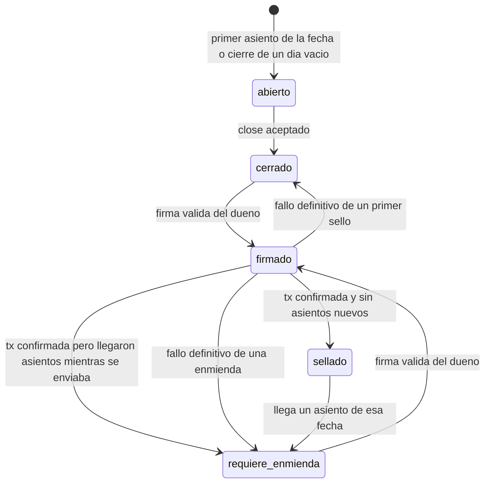
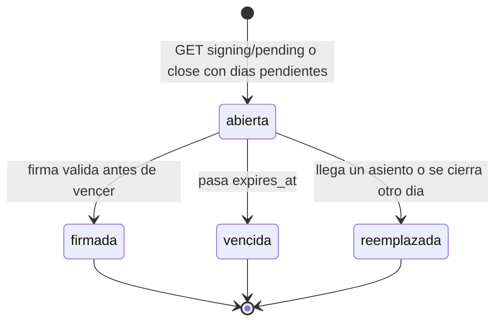
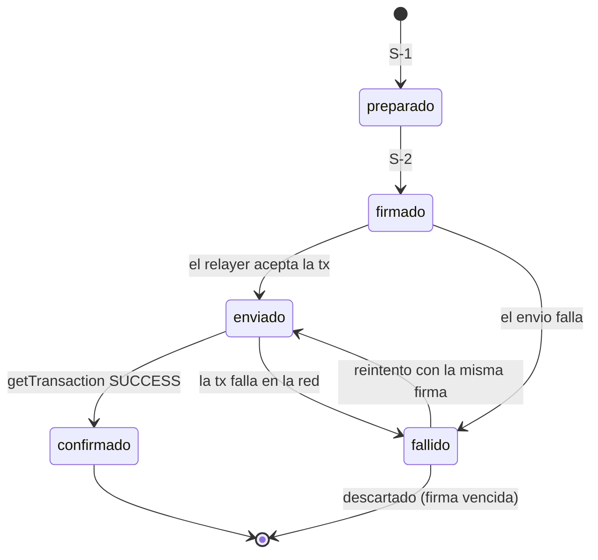
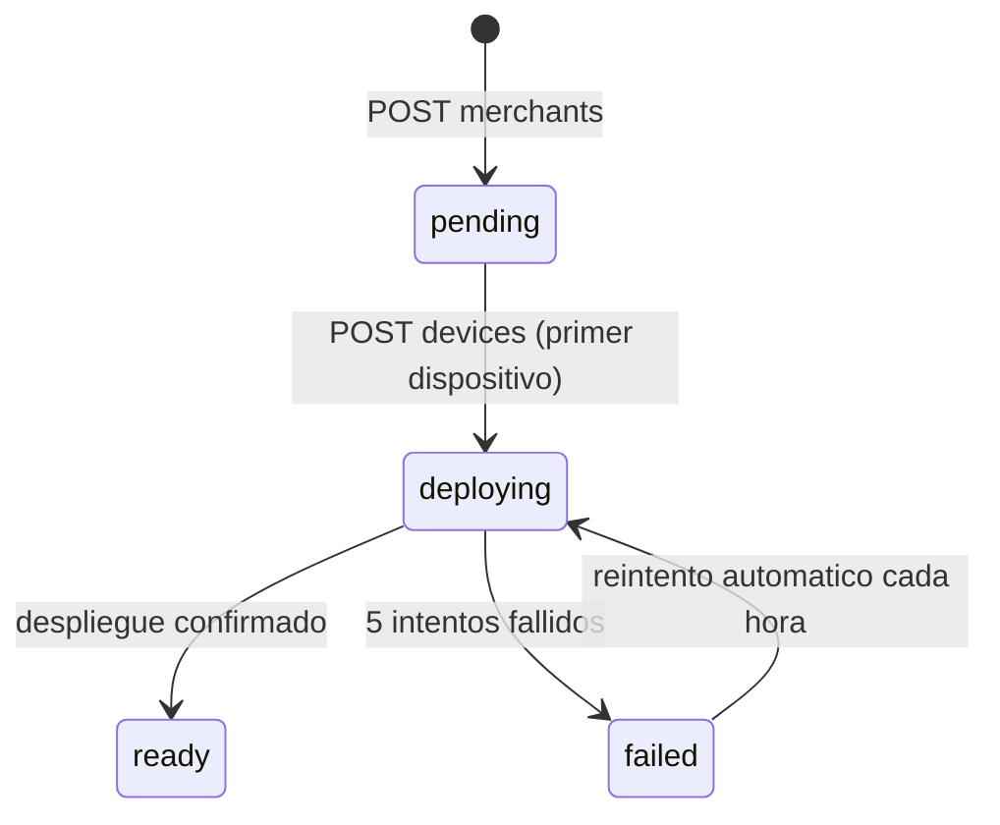

# Spec 07 — Máquinas de estado

**Estado:** v1.0 · **Depende de:** spec 01 (v1.2), spec 03, spec 04, spec 06 · **Lo usan:** `bimo-core` (módulos `cierre y sellado`, `stellar`, `comercios`), app

Única fuente de verdad sobre los estados y las transiciones. Ningún módulo cambia un `status` fuera de lo que dice esta tabla; todo cambio de estado ocurre en **una función del módulo dueño**, dentro de una transacción con un *advisory lock* de Postgres sobre el `merchant_id`.

---

## 1. Día de negocio (`business_days.status`)

| ID | Desde | Evento | Condición | Hacia | Efectos |
|---|---|---|---|---|---|
| D-1 | — | Llega el primer asiento de una fecha | — | `abierto` | Trigger DB-03 crea el día |
| D-2 | — | `close` de una fecha sin asientos | — | `cerrado` | Crea el día y lo cierra; se sellará con la raíz vacía (spec 02 §4) |
| D-3 | `abierto` | `POST /days/{date}/close` | Están todos los `entry_ids` enviados (si no: `409 missing_entries`) | `cerrado` | Guarda `counted_cash_minor`, `closed_at`, `closed_by`; reemplaza la solicitud de firma abierta si existe (S-4) |
| D-4 | `cerrado` o `requiere_enmienda` | Firma válida de una solicitud que incluye el día | — | `firmado` | Ver solicitud de firma (S-2) |
| D-5 | `firmado` | Sello `confirmado` (L-4) | Asientos del día = `entry_count` del sello | `sellado` | `current_seal_version` = versión del sello |
| D-6 | `firmado` | Sello `confirmado` (L-4) | Asientos del día > `entry_count` del sello | `requiere_enmienda` | `current_seal_version` = versión del sello |
| D-7 | `firmado` | Sello descartado (L-6) | Era la versión 1 | `cerrado` | — |
| D-8 | `firmado` | Sello descartado (L-6) | Era una enmienda | `requiere_enmienda` | — |
| D-9 | `sellado` | Llega un asiento de esa fecha | — | `requiere_enmienda` | Trigger DB-09 |
| D-10 | `cerrado` o `requiere_enmienda` | Llega un asiento de esa fecha | Hay solicitud abierta que incluye el día | (sin cambio) | Reemplaza la solicitud (S-4) |

**No existe "reabrir" un día.** Un día cerrado nunca vuelve a `abierto`; lo que llegue después se sella como enmienda (ADR-14).

**Días viejos sin cerrar:** se quedan `abierto`. La app los lista y permite cerrarlos uno por uno; para un día pasado, el conteo de efectivo es opcional (`counted_cash_minor = null`).

Cualquier otro evento en cualquier otro estado es un error: `409 day_not_closable` en la API, o una excepción interna que se registra.

---

## 2. Solicitud de firma (`signing_requests.status`, spec 01 v1.2)

Agrupa los días que el dueño confirma con un solo Face ID (spec 03 §5.5).

| ID | Desde | Evento | Hacia | Efectos |
|---|---|---|---|---|
| S-1 | — | `GET /signing/pending` o `close`, cuando hay días `cerrado` o `requiere_enmienda` sin solicitud abierta | `abierta` | Toma hasta 14 días, de los más viejos a los más nuevos. Para cada uno calcula la raíz Merkle (spec 02), guarda `seal_leaves` y crea un `seals` en `preparado` con la siguiente versión. Simula `seal_batch`, guarda la preimagen y `expiration_ledger` (spec 03 §5.1) |
| S-2 | `abierta` | `POST /signing/{id}/signature` con firma válida | `firmada` | La firma pasa al sello; cada sello va a `firmado` (L-2); cada día va a `firmado` (D-4) |
| S-3 | `abierta` | Pasa `expires_at` (lo detecta la siguiente petición o el worker) | `vencida` | Borra sus sellos en `preparado` y sus `seal_leaves`; nunca llegaron a la cadena |
| S-4 | `abierta` | Asiento nuevo de un día incluido, o `close` de otro día | `reemplazada` | Igual que S-3. La siguiente `GET /signing/pending` crea una nueva con los datos al día |

- Hay **como máximo una** solicitud `abierta` por comercio (índice único parcial, spec 01 v1.2).
- Firmar una solicitud `vencida` responde `409 signature_expired`; una `reemplazada`, `409 request_superseded`. La app pide la nueva y vuelve a mostrar el resumen.
- Las solicitudes se crean **cuando el dueño está presente**: cuando abre la pantalla de firma o cierra. Así la preimagen está fresca y casi nunca vence.

---

## 3. Sello (`seals.status`)

| ID | Desde | Evento | Condición | Hacia | Efectos |
|---|---|---|---|---|---|
| L-1 | — | S-1 | — | `preparado` | — |
| L-2 | `preparado` | S-2 | — | `firmado` | Normaliza low-S, arma `AuthPayload`, firma la entrada del atestador y encola `seal.submit` en `outbox_messages` |
| L-3 | `firmado` o `fallido` | El worker envía por el puerto `Enviador` y el relayer acepta | Ledger actual < `expiration_ledger` | `enviado` | Guarda `tx_hash`. Todos los sellos de la misma solicitud comparten `tx_hash` |
| L-4 | `enviado` | `getTransaction` = `SUCCESS` | — | `confirmado` | `ledger_seq`, `confirmed_at`; dispara D-5 o D-6 en cada día |
| L-5 | `firmado` o `enviado` | El envío o la transacción fallan | — | `fallido` | Guarda `error`; el outbox reintenta con backoff (spec 01) |
| L-6 | `fallido` | Reintento | Ledger actual ≥ `expiration_ledger` | (se borra) | Escribe el motivo en `audit_log`, borra el sello y sus hojas, y dispara D-7 o D-8. La próxima solicitud lo vuelve a crear |

- **Un sello `confirmado` es inmutable** (DB-12, spec 01 v1.2): no se edita ni se borra, salvo por `forget_merchant`.
- Si `getTransaction` dice que la tx no existe después de la expiración, se trata como fallo (L-5) y luego L-6.
- El indexador (ADR-11) compara cada evento `sealed` con los sellos `confirmado`. Si encuentra un evento sin sello o con una raíz distinta, genera una alerta crítica y no cambia ningún estado.

---

## 4. Cuenta Stellar del comercio (`merchants.account_status`, spec 01 v1.2)

| ID | Desde | Evento | Hacia | Efectos |
|---|---|---|---|---|
| A-1 | — | `POST /merchants` | `pending` | — |
| A-2 | `pending` | `POST /devices` válido | `deploying` | Encola `account.deploy` |
| A-3 | `deploying` | Despliegue confirmado | `ready` | Guarda `stellar_address`; la app comprueba el firmante (spec 03 §6) |
| A-4 | `deploying` | 5 fallos seguidos | `failed` | Alerta |
| A-5 | `failed` | Reintento horario | `deploying` | — |

La app puede **vender** en cualquier estado. Solo **firmar sellos** exige `ready`; mientras tanto, los días cerrados esperan.

---

## 5. Otros estados

| Entidad | Estados | Regla |
|---|---|---|
| Asiento local (spec 04) | `pendiente` → `sincronizado` · `pendiente` → `rechazado` | Nunca vuelve atrás. Un rechazado no se reintenta |
| Dispositivo (`devices`) | activo (`revoked_at` nulo) → revocado | Irreversible. Un dispositivo revocado recibe `403 device_revoked` |
| Enlace de verificación | activo → vencido (por fecha) · activo → revocado | Derivado de `expires_at` y `revoked_at`; no hay columna de estado |
| Mensaje del outbox del servidor | `pendiente` → `enviado` · `pendiente` → `fallido` | `fallido` solo después de 20 intentos; genera alerta |

---

## 6. Textos para la app

Los estados nunca se muestran con su nombre técnico (QA-04):

| Estado del día | Lo que ve el dueño |
|---|---|
| `abierto` | "Abierto" |
| `cerrado` (con solicitud pendiente) | "Cerrado · falta tu confirmación" |
| `firmado` | "Guardando tu cierre…" |
| `sellado` | "Sellado ✓" |
| `requiere_enmienda` | "Llegaron ventas después del cierre · confirma de nuevo" |
| Cuenta `deploying` | "Preparando tu cuenta…" (no bloquea vender) |
| Cuenta `failed` | "Estamos terminando de preparar tu cuenta. Puedes seguir vendiendo." |

---

## 7. Criterios de aceptación

- [ ] Hay una prueba por cada transición D-1 a D-10, S-1 a S-4, L-1 a L-6 y A-1 a A-5, y una prueba de que cualquier otra transición falla.
- [ ] Dos peticiones simultáneas de cierre y firma del mismo comercio no dejan estados inconsistentes (advisory lock).
- [ ] Un asiento que llega mientras el sello está `enviado` deja el día en `requiere_enmienda` tras la confirmación (D-6).
- [ ] Una firma enviada después de `expires_at` responde `409 signature_expired` y la siguiente `GET /signing/pending` devuelve una solicitud nueva.
- [ ] Un sello que no se pudo enviar antes de su expiración se descarta (L-6) y el día vuelve a esperar firma, sin dejar filas con la misma versión.
- [ ] Un `UPDATE` o `DELETE` sobre un sello `confirmado` falla (DB-12).
- [ ] Con la cuenta en `deploying`, la app registra y sincroniza ventas normalmente.
